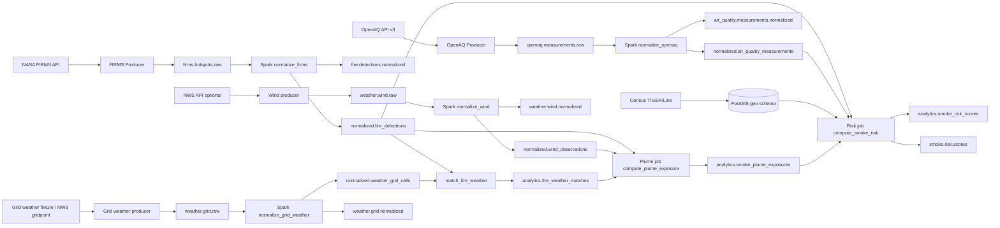

# wildfire-smoke-risk-correlator

This repository implements a **Kafka + Spark + PostGIS** pipeline that correlates **NASA FIRMS active-fire hotspots** and **OpenAQ PM measurements** (PM2.5 and PM10-style parameters) to **U.S. Census county and tract geometries**, then publishes an **engineering smoke-risk index** per county/tract for a recent time window.

**Phase 2** adds **ingestion run tracking** in Postgres, **risk model v2** with JSON explanations and spatial nearby-fire signal, **SQL views** for Grafana-friendly analytics, **`make quality-check`** / **`make replay-fixtures`**, and **optional Grafana** dashboards (Compose profile `grafana`).

**Phase 3** adds **GeoJSON / centroid presentation views** for maps (`analytics.v_latest_smoke_risk_*_geojson`, point GeoJSON for fires/AQ), **Grafana geomap panels** (centroid markers; GeoJSON preview tables for polygons), **SLI views + `analytics.fn_alert_candidates`**, **`make alerts-check`** (thresholds via `ALERT_*` env vars), **multi-state census bootstrap** (`CENSUS_STATEFPS`, optional national counties), **materialized snapshots** + **`make refresh-mviews`**, and **`make demo`** as a **no-secrets** local walkthrough.

**Phase 4** adds **`analytics.alert_events`** (stable fingerprints + deduped open incidents), **`make alerts-materialize`** / **`make alerts-send`** with **console / webhook / Slack / SMTP** notifiers, **operator runbooks** under `docs/runbooks/`, **bounded `make ingest-live-once`** (requires `FIRMS_MAP_KEY`; rejects huge bboxes unless explicitly allowed), and **`make operational-cycle`** for a repeatable fixture or live loop.

**Phase 5** adds **`analytics.notification_attempts`** (durable delivery audit with **destination hashes**, safe errors, **retry_after**), **retry/backoff + max attempt caps**, **`make alerts-send-digest`** / **`make alerts-send-retry`**, **`analytics.operational_runs`** instrumentation from **`scripts/run_operational_cycle.sh`**, **operator evidence SQL views** (wired into Grafana tables), an **optional Compose `scheduler` profile** (`operational-scheduler` using **Docker CLI + socket**—treat as advanced), and **systemd unit/timer templates** under `deploy/systemd/`.

**Phase 6** adds **bounded wind observation ingestion** (`weather.wind.raw` → **`normalized.wind_observations`**), a **`wind_v1` corridor plume approximation** into **`analytics.smoke_plume_exposures`** (**not** dispersion modeling), **smoke risk model `v3`** (blends the existing **v2** base score with max plume exposure), **SQL transport views** (`analytics.v_latest_wind_observations*`, `analytics.v_smoke_transport_summary`, …), **Grafana wind/plume panels**, and **alert candidates** `wind_data_stale`, `no_recent_wind_data`, `high_plume_exposure` with runbooks.

**Phase 7** adds **durable parse-error quarantine** (`analytics.parse_errors`), **Spark normalizer offset evidence** (`analytics.kafka_consumer_offsets`; distinct from broker-internal committed offsets unless unified later), **source-specific Kafka DLQs** plus a shared **`normalization.errors`** stream, **`make replay-bad-fixtures`** / **`make replay-dlq`** ( **`DRY_RUN=1` default** ), **`make dlq-smoke-test`** (bad fixtures + normalize + assertions), expanded **`make quality-check`** / **`make smoke-test`** hooks, **SQL + Grafana operational views**, and alert candidates **`parse_errors_high`**, **`parser_failure_spike`**, **`dlq_records_present`**, **`consumer_offset_stale`** with runbooks.

**Phase 8** adds **bounded `WIND_BBOX` → NWS station discovery** (still overridden by **`WIND_STATION_IDS`**), **broker watermark + lag observations** (`analytics.kafka_topic_offsets`, `analytics.kafka_consumer_lag_observations`; distinct from Phase 7 application offsets), **`make collect-lag`** / **`make kafka-lag`**, **DLQ depth / pipeline lag SQL views**, **durable DLQ replay bookkeeping** (`analytics.dlq_replay_runs`, `analytics.dlq_replay_items`), **parse-error compaction / archival** (`make parse-errors-compact`, **`DRY_RUN=1` default**), **env-linked parser spike + lag + DLQ depth thresholds**, new alert candidates **`kafka_lag_high`**, **`dlq_depth_high`**, **`replay_failures_recent`**, **`COLLECT_LAG`** near the end of **`make operational-cycle`** (non-fatal unless **`STRICT_LAG_COLLECTION=1`**), and Grafana tables for lag / replay visibility.

**Phase 9** adds **bounded gridded weather** (`weather.grid.raw|normalized|dlq`), **`raw.gridded_weather`** + **`normalized.weather_grid_cells`** + **`analytics.fire_weather_matches`**, Spark **`normalize_grid_weather`** / **`match_fire_weather`**, plume model **`wind_grid_v2`** (prefers matched grid wind; optional **`PLUME_GRID_FALLBACK_TO_STATION`**), risk model **`v4`** (v2 base + grid plume blend + humidity dampening — still **not** dispersion-grade), SQL presentation views, alerts (**`grid_weather_stale`**, **`no_recent_grid_weather`**, **`fire_weather_unmatched_high`**, **`grid_weather_parse_errors_high`**), Grafana tables, and **`make grid-weather-demo`** / **`GRID_WEATHER_SMOKE=1`** smoke hooks.

**Phase 10** adds **no-secrets Compose integration regression** (`make integration-regression`; optional **`RUN_BOOTSTRAP=1`** / default **`SKIP_BOOTSTRAP=1`** to avoid census re-download), **fixture timestamp modes** (`FIXTURE_TIME_MODE=static|relative` with **`FIXTURE_RELATIVE_BASE_HOURS_AGO`**) that rewrite payloads **in memory only** (metadata: **`original_observed_at`**, **`fixture_time_rewritten`**), **deterministic aligned fixtures** (`USE_ALIGNED_FIXTURES=1`), **`make assert-integration-state`** / **`scripts/assert_integration_state.sh`**, **`make evaluate-risk`** over **`analytics.risk_observations`** vs **`analytics.smoke_risk_scores`** (exits **0** when nothing to compare), a **`GridWeatherProvider`** abstraction (**fixture** + **NWS `/points` → `forecastGridData`** with point cache and **`GRID_WEATHER_POINTS`** / **`GRID_WEATHER_MAX_POINTS`** bounds), calibration DDL (**`analytics.risk_observations`**, **`analytics.risk_model_evaluations`**) + SQL views (`analytics.v_integration_pipeline_counts`, …), new alert candidates (**`integration_pipeline_incomplete`**, **`v4_risk_missing`**, **`fire_weather_match_missing`**) with runbooks, **`make integration-smoke-test`**, and Grafana panels for pipeline counts / v4 explanations / unmatched fire–weather / calibration summaries.

**Phase 11** adds a **bounded Gaussian dispersion proxy** (`DISPERSION_MODEL_VERSION=gaussian_v0`) materialized as **`analytics.smoke_dispersion_exposures`**, optional **AQ lag-window comparisons** (`analytics.dispersion_aq_comparisons`; scaffolding only), **risk model `v5`** (v2-style base blended with plume + dispersion + capped humidity dampening), **`make compute-dispersion`** / **`make compare-dispersion-aq`** / **`make dispersion-demo`**, **`DISPERSION_ENABLED=1`** hooks in **`make operational-cycle`** (defaults **off**), new alert candidates (**`high_dispersion_exposure`**, **`dispersion_no_wind_matches`**, **`dispersion_no_targets`**, **`dispersion_aq_mismatch_high`**), Grafana tables, and **`EXPECT_DISPERSION=1`** strict assertions in **`make integration-regression`**. **Not HYSPLIT**, **not regulatory dispersion**, **not a health model** — compare against corridor plumes (`wind_v1` / `wind_grid_v2`) only as distinct engineering heuristics.

**Phase 12** adds **qualitative evidence labels** on dispersion–AQ comparisons (**`no_aq_data`**, **`insufficient_aq_data`**, **`possible_overprediction`**, …), **richer `risk_model_evaluations`** metrics (MAE/RMSE, optional correlation when ≥`RISK_EVAL_MIN_MATCH_COUNT`, heuristic precision/recall on high bands), **JSONL observation fixtures** + **`make load-risk-observation-fixtures`**, **`make calibration-summary`** / **`make calibration-demo`**, calibration **SQL views**, low-severity **calibration alert candidates** (`model_overprediction_possible`, …), Grafana tables, and **`STRICT_CALIBRATION_ASSERTS`** / **`LOAD_RISK_OBSERVATION_FIXTURES`** hooks — **not scientific validation**.

**Phase 13** adds **GitHub Actions CI** (fast **`SMOKE_NO_COMPOSE=1`** smoke, no Census download), an **optional Compose integration workflow** (manual / weekly / PR label **`integration`**), **synthetic minimal census fixtures** + **`make db-bootstrap-minimal`**, **immutable calibration exports** (`make export-calibration*`), **`make release-check`** / **`make version`**, **`CHANGELOG.md`**, **`docs/release/v1.0.0.md`**, short **architecture notes**, and a Grafana **calibration confidence banner** — **still not scientific validation**.

**Phase 14** prepares **v1.0.0**: canonical **`analytics.fn_alert_candidates`** migration (**`013_phase14_canonical_alert_function.sql`**) applied **after** dependent views, **`make db-doctor`** drift checks, **`make repair-alert-function`** for legacy overload issues, **`make release-manifest`**, optional isolated **`make release-fresh-volume-test`**, optional **`uv sync --extra parquet`** for Parquet exports — framed as a **stable local/demo/research platform**, **not** public-health or regulatory validation.

Wind direction uses the **meteorological convention** (*wind FROM*); modeled smoke transport uses the **opposite bearing** (see `src/wildfire_smoke/wind.py`).

**Important:** the risk score is a **demonstration / operations correlation index**, not a health advisory model.

## What this project does

- **Ingest** FIRMS CSV hotspot rows into Kafka (`firms.hotspots.raw`).
- **Ingest** OpenAQ v3 measurements into Kafka (`openaq.measurements.raw`).
- **Ingest** wind observations into Kafka (`weather.wind.raw`; fixtures via **`WIND_DRY_RUN=1`**, or bounded **NWS** adapter via **`WIND_STATION_IDS`** or **`WIND_BBOX`** station discovery with **`WIND_STATION_DISCOVERY_LIMIT`**).
- **Normalize** Kafka messages into PostGIS tables (`normalized.*`) using Spark batch jobs, including **spatial association** to `geo.counties` / `geo.tracts`.
- **Optional grid weather:** bounded ingest to **`weather.grid.raw`** → **`normalized.weather_grid_cells`**, then **`analytics.fire_weather_matches`** links fires to nearest cells (`make match-fire-weather`).
- **Compute** configurable-window risk scores into `analytics.smoke_risk_scores` (models **v1**, **v2**, **v3**, and optional **`v4`** when grid weather is enabled) and publish JSON snapshots to Kafka (`smoke.risk.scores`).
- **Compute** optional **plume corridor exposures** (`make compute-plume`): **`wind_v1`** (station wind) or **`wind_grid_v2`** (matched grid wind; engineering heuristic only).
- **Bootstrap** county + tract boundaries from Census TIGER/Line (default **Tennessee**; optional **multi-state** or **national county** load via env — see below).

## Architecture



## Quickstart (local)

### Prerequisites

- Docker + Docker Compose
- `uv` (recommended) or another Python 3.11+ toolchain
- `bash`, `curl`, `unzip`

### Configure environment

Copy `.env.example` to `.env` and fill in secrets as needed:

- **Live FIRMS ingestion** requires `FIRMS_MAP_KEY` (never commit it).
- **OpenAQ** may require `OPENAQ_API_KEY` depending on current API access behavior.

### Bring the stack up

```bash
make up
```

### Create Kafka topics

```bash
make topics
```

### Bootstrap PostGIS + Census boundaries (Tennessee by default)

```bash
make db-bootstrap
```

This downloads shapefiles into `data/raw/census/`, loads them via `ogr2ogr` (see `gdal-utils` profile in `docker-compose.yml`), validates counts/SRID/indexes, applies **idempotent SQL migrations** under `sql/migrations/`, then reapplies SQL views from `sql/views/`.

### Run validation

Unit tests:

```bash
make deps
make test
```

End-to-end smoke checks (Postgres + topics + **explicit fixture dry-run producers** + views + Spark risk job):

```bash
make smoke-test
```

### Run one ingestion cycle

Live ingestion (requires keys + network):

```bash
make ingest-once
```

**Explicit fixture dry-run path** (no NASA/OpenAQ network calls; uses checked-in fixtures under `tests/fixtures/`):

```bash
export FIRMS_DRY_RUN=1
export OPENAQ_DRY_RUN=1
# Optional overrides:
# export FIRMS_FIXTURE_CSV=tests/fixtures/firms_sample.csv
# export OPENAQ_FIXTURE_JSONL=tests/fixtures/openaq_sample.jsonl
make ingest-once
```

### Normalize Kafka → PostGIS + publish normalized topics

```bash
make normalize
```

### Compute smoke risk

Runs the Python risk job in the Spark container (defaults: **v2** model, **24h** lookback, **50 km** nearby-fire radius, **both** county and tract). Override via environment (also respected when exported before `make compute-risk`):

- `SMOKE_RISK_MODEL_VERSION` / `RISK_MODEL_VERSION` — `v1`, `v2`, `v3`, or `v4` (default `v2`; **`v4`** expects grid plume inputs when enabled)
- `SMOKE_RISK_LOOKBACK_HOURS` — default `24`
- `SMOKE_RISK_NEARBY_KM` — default `50`
- `SMOKE_RISK_GEOGRAPHIES` — `county`, `tract`, or `both`

```bash
make compute-risk
```

### Replay fixtures (no API keys)

Publishes checked-in FIRMS/OpenAQ fixtures to Kafka and optionally runs normalization + risk (defaults **on**):

```bash
make replay-fixtures
```

Disable downstream steps with `REPLAY_RUN_NORMALIZE=0` and/or `REPLAY_RUN_COMPUTE=0`.

### Data quality check

Structural failures (missing tables, invalid census geometries, duplicate normalized IDs, unreachable DB) exit non-zero. Soft issues (empty tables, stale timestamps, unmatched geoids) emit warnings only.

```bash
make quality-check
```

### Grafana (optional)

```bash
make grafana-up
```

- UI: `http://localhost:3001` (override with `GRAFANA_PORT`; default **3001** avoids clashes with apps on `:3000`).
- Login defaults: `GRAFANA_ADMIN_USER` / `GRAFANA_ADMIN_PASSWORD` (`admin` / `admin` unless overridden).
- Postgres datasource and dashboard JSON are provisioned from `docker/grafana/provisioning/` and `docker/grafana/dashboards/smoke-risk.json`.
- **Maps (Phase 3):** county / tract **risk markers at centroids** (geomap), fire and AQ **point maps**, plus **GeoJSON preview** tables (truncated text). Canonical polygons remain in `geo.*`; dashboard views are documented as presentation-only.
- **Tables:** top 20 risk areas, ingestion runs, source freshness, data quality summary.
- **Limitation:** native GeoJSON polygon fills from Postgres in Grafana can be finicky in provisioned JSON; this dashboard favors **reliable marker maps + GeoJSON snippets** over brittle polygon layers.

### Alerting / SLIs (SQL-first)

- **Views:** `analytics.v_sli_*` surface ingestion failures, freshness ages, sparse recent rows, and high-risk rows.
- **Candidates:** `analytics.fn_alert_candidates(...)` unions actionable rows with **20** threshold parameters (freshness, risk/plume, parse-error counts, consumer-offset stale hours, parser spike counts, Kafka lag message floors, DLQ depth proxy floors, grid-weather staleness hours, fire–weather unmatched warn/critical counts, **dispersion** floors — see `scripts/check_alerts.sh` / `wildfire_smoke.alert_thresholds`). `analytics.v_alert_candidates` applies SQL defaults on the function (CLI passes env-derived values).
- **CLI:** `make alerts-check` prints candidates and exits **2** if any **`severity = critical`** exists. Set **`ALERTS_WARN_ONLY=1`** to always exit 0 (recommended for fixture demos where timestamps are intentionally stale).
- **Threshold env:** `ALERT_FRESHNESS_WARN_HOURS` (default 6), `ALERT_FRESHNESS_CRITICAL_HOURS` (24), `ALERT_HIGH_RISK_MIN_SCORE` (75), `ALERT_LOOKBACK_HOURS` (24), `ALERT_HIGH_PLUME_EXPOSURE_MIN_SCORE` (70), `ALERT_PARSE_ERRORS_WARN_COUNT` (1), `ALERT_PARSE_ERRORS_CRITICAL_COUNT` (25), `ALERT_CONSUMER_OFFSET_STALE_HOURS` (6), `ALERT_PARSER_SPIKE_WARN_COUNT` (15), `ALERT_PARSER_SPIKE_CRITICAL_COUNT` (40), `ALERT_KAFKA_LAG_WARN_MESSAGES` (100), `ALERT_KAFKA_LAG_CRITICAL_MESSAGES` (1000), `ALERT_DLQ_DEPTH_WARN_MESSAGES` (1), `ALERT_DLQ_DEPTH_CRITICAL_MESSAGES` (100), `ALERT_GRID_WEATHER_STALE_HOURS` (6), `ALERT_FIRE_WEATHER_UNMATCHED_WARN_COUNT` (5), `ALERT_FIRE_WEATHER_UNMATCHED_CRITICAL_COUNT` (25).

### Phase 4 — persisted alerts, notifications, bounded live ingest

**Lifecycle**

1. SQL surfaces candidates (`fn_alert_candidates` / `v_alert_candidates`).
2. `make alerts-materialize` reads candidates, computes a stable **fingerprint** per logical incident, and **upserts** `analytics.alert_events` (refreshing `last_seen_at` while `status` is `open`/`acknowledged`).
3. `make alerts-send` delivers **open** rows through the selected notifier and records per-notifier metadata inside `notification_state` JSON (skipping repeats unless **`FORCE_NOTIFY=1`**).
4. Optional `ALERTS_RESOLVE_MISSING=1` resolves **open** rows whose fingerprints disappear from the latest candidate set (use carefully with oscillating fixture data).

**Deduping**

- Partial unique index on **`fingerprint`** while `status IN ('open','acknowledged')` prevents duplicate active incidents.
- Fingerprints **exclude** wall-clock `observed_at`; they combine normalized severity, geography keys, alert type, and small stable details (e.g., ingestion `source`, smoke-risk `model_version`/`risk_band`).

**Materialize env**

- `ALERTS_DRY_RUN=1` — print planned upserts without writes.
- `ALERTS_RESOLVE_MISSING=1` — auto-resolve stale open incidents missing from the candidate snapshot.

**Notifier env**

- `ALERT_NOTIFIER` — `console` (default), `webhook`, `slack`, `smtp` / `email`.
- `ALERT_SEVERITY_MIN` — `info`, `warning`, `high`, `critical` (default **`high`**). SQL `warn` maps to `warning`, except **`high_smoke_risk` warn → `high`**.
- `ALERT_LIMIT` — max rows scanned from open incidents (default **20**).
- `FORCE_NOTIFY=1` — bypass “already sent for this `last_seen_at`” suppression.
- Webhook: `ALERT_WEBHOOK_URL`, optional `ALERT_WEBHOOK_HEADERS_JSON` (object JSON for extra headers).
- Slack incoming webhook: `SLACK_WEBHOOK_URL`.
- SMTP: `SMTP_HOST`, `SMTP_PORT`, `SMTP_USER`, `SMTP_PASSWORD`, `ALERT_EMAIL_FROM`, `ALERT_EMAIL_TO`.

**Bounded live ingest**

```bash
export FIRMS_MAP_KEY=...           # required
export OPENAQ_API_KEY=...          # optional depending on tenant behavior
export LIVE_INGEST_BBOX=-88.2,34.9,-81.6,36.7   # Tennessee-ish default inside the script
make ingest-live-once
```

- Refuses bbox spans larger than **`LIVE_INGEST_MAX_SPAN_DEG`** (default **14°**) unless **`LIVE_INGEST_ALLOW_LARGE_BBOX=1`**.
- Prints bbox sources **without secrets**, then runs producers → normalize → compute-risk → quality-check → materialize → console send (override notifier via env).

**Operational cycle**

```bash
# Fixture/no-secrets path (default): replay producers only, then batch jobs + alerts
make operational-cycle LIVE_MODE=0 ALERT_NOTIFIER=console

# Live bounded path (requires FIRMS_MAP_KEY + acceptable bbox)
make operational-cycle LIVE_MODE=1
```

`LIVE_MODE=0` defaults `ALERTS_WARN_ONLY=1` for downstream tooling consistency (the cycle itself runs quality-check + alert materialization rather than `alerts-check`).

Phase 5 records each fixture/live cycle into **`analytics.operational_runs`** with JSON **`steps`** (names/status/timestamps only—no secrets).

Phase 8 appends a **`collect_lag`** step when **`COLLECT_LAG=1`** (default **1**): `scripts/collect_kafka_lag.sh` snapshots broker highs and approximate lag vs application offsets. Failures are **`warn`** unless **`STRICT_LAG_COLLECTION=1`**. Alerts are materialized **after** lag collection so **`kafka_lag_high`** / **`dlq_depth_high`** candidates can appear in the same cycle.

When **`GRID_WEATHER_ENABLED=1`**, Phase 9 hooks **`make operational-cycle`** to replay grid fixtures (fixture mode), run **`normalize-grid-weather`** + **`match-fire-weather`**, and default **`PLUME_MODEL_VERSION=wind_grid_v2`** / **`RISK_MODEL_VERSION=v4`** for downstream jobs unless overridden.

### Phase 5 — notification reliability, digest, scheduling

**Attempts table**

- Each delivery creates rows in **`analytics.notification_attempts`** (`succeeded` / `failed` / `skipped`).
- **`destination_hash`** hashes a normalized destination descriptor (never store raw webhook URLs or SMTP passwords).
- Failures record **`error_class`** + truncated **`error_message`** safe for logs.

**Retries**

- Backoff after failures: **5m**, then **15m**, then **60m** (`retry_after` column).
- **`ALERT_RETRY_DISABLED=1`** skips backoff gating (still enforces **`ALERT_MAX_ATTEMPTS`** unless you adjust workflow).
- **`ALERT_MAX_ATTEMPTS`** (default **5**) counts non-`skipped` attempts per `(alert_event_id, notifier)`.
- **`FORCE_NOTIFY=1`** bypasses “already sent for this `last_seen_at`” suppression via `notification_state`, but attempts are still logged.

**Digest mode**

- **`make alerts-send-digest`** sets **`ALERT_DIGEST=1`** and **`--digest`** (single summarized message per notifier invocation).
- **`ALERT_DIGEST_WINDOW_HOURS`** (default **24**) filters digest inclusion by `observed_at`.
- **`ALERT_DIGEST_MAX_ITEMS`** caps digest cardinality (default **50**).
- Digest output calls out **severity counts**, **newest observed time**, **titles**, **geographies**, and **runbook slugs**, and explicitly tells operators to verify criticals in SQL—not a substitute for paging critical incidents.

**Retry queue mode**

- **`make alerts-send-retry`** sets **`ALERT_RETRY_QUEUE=1`** + **`--retry-queue`**, targeting alerts whose **latest** attempt for that notifier was **`failed`** (fresh retries still obey backoff unless disabled).

**Rate limiting / cooldown**

- **`ALERT_SEND_COOLDOWN_SECONDS`** (default **0**) suppresses *all* sends for a notifier if the latest attempt was within the cooldown window.

**Scheduling**

- **Recommended:** install `deploy/systemd/wildfire-smoke-operational.{service,timer}` on a host with Docker/Compose access, editing **`WorkingDirectory`** / **`EnvironmentFile`** to your checkout.
- **Optional Compose:** `make operational-scheduler-up` starts **`operational-scheduler`** (`--profile scheduler`). It mounts **`/var/run/docker.sock`** and periodically `docker compose exec`s `spark-worker` to run `scripts/run_operational_cycle.sh` (fixture mode by default; set **`LIVE_MODE=1`** explicitly for live). This is **disabled by default** and should be treated as an advanced integration.

**Grafana**

- Dashboard panels query **`analytics.v_open_alert_events`**, **`v_notification_attempt_summary`**, **`v_notification_failures`**, **`v_alert_delivery_state`**, and **`v_recent_operational_cycles`**.

**Runbooks**

- Human procedures live under `docs/runbooks/` and are mapped from `alert_type` via `config/runbooks.yaml` into `alert_events.runbook_slug`.

### Materialized views (optional performance)

- **`analytics.mv_latest_smoke_risk_by_{county,tract}`** and **`analytics.mv_latest_smoke_risk_{county,tract}_geojson`** mirror the latest/geo views with **unique indexes** for `REFRESH MATERIALIZED VIEW CONCURRENTLY`.
- Refresh after large loads: `make refresh-mviews` (runs `scripts/refresh_materialized_views.sh`).
- Prefer plain **views** for simplicity locally; use **materialized** copies when map queries feel heavy.

### Multi-state census bootstrap

Defaults stay **Tennessee-only** to keep downloads small.

| Env | Behavior |
|-----|----------|
| `CENSUS_STATEFP=47` | Single state (overrides yaml default when set). |
| `CENSUS_STATEFPS=47,37,21` | Multiple states: **tract zip per state**; counties from **one national county file** filtered to those FIPS (unless national-full flag below). |
| `CENSUS_LOAD_NATIONAL_COUNTIES=1` | Load **all US counties** (large); tracts still limited to selected states. Validation expects **≥ `min_counties_national_us`** (see `config/census.yaml`). |

Row counts per state are printed after load (`GROUP BY statefp`). Scripts remain **idempotent** (truncate `geo.*` + reload staging).

### One-command demo (no API keys)

```bash
make demo
```

Runs `up`, `db-bootstrap`, `topics`, `replay-fixtures`, `normalize`, `compute-plume`, `compute-risk`, `quality-check`, optional `refresh-mviews` (`DEMO_REFRESH_MVIEWS=0` to skip), then prints **Grafana / Console / Spark / psql** hints. Uses **`FIRMS_DRY_RUN` / `OPENAQ_DRY_RUN` / `WIND_DRY_RUN`** inside `replay-fixtures`; never requires live keys.

### Reset everything (destructive)

```bash
make reset
```

This wipes the Postgres volume, recreates topics, re-downloads Census data for the configured state/year fallback list, reloads boundaries, and reapplies SQL views.

## Phase 7 — parse errors, DLQs, and replay safety

**Postgres**

- **`analytics.parse_errors`**: one row per logical open failure (`payload_hash` + `error_class` + consumer group + topics), with rolling **`occurrence_count`** and JSONB **`payload_sample`** / **`error_context`** (no secrets; oversized payloads are truncated in helpers under `src/wildfire_smoke/dlq.py`).
- **`analytics.kafka_consumer_offsets`**: last processed / success / error offsets per **`(consumer_group, topic, partition)`** written by Spark normalizers as **evidence**, not as a replacement for Kafka’s internal consumer group commits.

**Kafka**

- **Per-source DLQs:** `firms.hotspots.dlq`, `openaq.measurements.dlq`, `weather.wind.dlq`.
- **Fan-in diagnostics:** `normalization.errors` receives the same envelope as the source DLQ (operators can subscribe once for all normalizers).

**Envelope (published JSON)**

- Includes `source_topic`, `target_dataset`, `consumer_group`, `original_key`, `original_partition`, `original_offset`, `payload_hash`, `error_class`, `error_message`, `error_context`, **`original_payload`** (sanitized/truncated), and `failed_at`.

**Workflows**

- **`make replay-bad-fixtures`**: publishes intentionally malformed CSV/JSONL fixtures to raw topics (no API keys).
- **`make replay-dlq`**: reads **`analytics.parse_errors`** by default (`DLQ_SOURCE_MODE=postgres`) or a DLQ topic (`DLQ_SOURCE_MODE=kafka`); defaults to **`DRY_RUN=1`**. Filter with **`SOURCE_TOPIC`**, **`TARGET_DATASET`**, **`STATUS`**, **`DLQ_REPLAY_LIMIT`**. Optional **`DLQ_RESOLVE_ON_REPLAY=1`** marks replayed Postgres rows **`resolved`** when not dry-running.
- **`make dlq-smoke-test`**: `replay-bad-fixtures` → full **`make normalize`** → asserts **`parse_errors`** gained rows → dry-run **`replay-dlq`** → compiles Phase 7 views.
- **`make smoke-test`**: lightweight Phase 7 checks (topics, tables, views, `replay-bad-fixtures`, **`replay-dlq` dry-run`). Set **`DLQ_SMOKE=1`** to chain **`dlq-smoke-test`** after the standard smoke path (slower; exercises Spark on poison messages).

**Quality / alerts**

- **`make quality-check`** fails if Phase 7 tables or DLQ topics are missing; warns on open parse errors, 24h parse-error counts, and missing Spark offset-evidence rows.
- New alert runbooks live under `docs/runbooks/parse-errors-high.md` (and related filenames); mappings are in `config/runbooks.yaml`.

**Known limitations**

- Postgres replay uses **`payload_sample`** (may be truncated); Kafka DLQ replay uses **`original_payload`** from the envelope when available.
- **`consumer_offset_stale`** warns when **no** `spark-normalize%` evidence exists yet (common before the first successful normalization on a fresh volume).

## Phase 8 — broker lag, DLQ depth, replay bookkeeping, wind discovery

**Wind**

- Set **`WIND_BBOX=min_lon,min_lat,max_lon,max_lat`** for bounded **NWS `/stations`** discovery (paginated, capped by **`WIND_STATION_DISCOVERY_LIMIT`**, default **25**). **`WIND_STATION_IDS`** still wins when non-empty.
- Discovery reuses **`LIVE_INGEST_MAX_SPAN_DEG`** / **`LIVE_INGEST_ALLOW_LARGE_BBOX`** guards (same semantics as live FIRMS/OpenAQ bbox safety).
- Optional **`WIND_STATION_DISCOVERY_RADIUS_KM`** expands matching to stations near (but outside) the bbox.
- Tests and dry workflows can set **`NWS_STATIONS_FIXTURE_JSON`** to a repo JSON fixture (no network). Live calls should set a descriptive **`NWS_USER_AGENT`** (a default string logs a warning).

**Broker vs application offsets**

- **`analytics.kafka_consumer_offsets`** (Phase 7): Spark normalizer **application evidence**.
- **`analytics.kafka_topic_offsets`** / **`analytics.kafka_consumer_lag_observations`** (Phase 8): broker **high watermarks** and **approximate lag** (`high_watermark - application current_offset` per sampled row). Treat as operational telemetry, not a substitute for Kafka consumer-group tooling.

**Operational scripts**

- **`make collect-lag`** / **`make kafka-lag`**: run `scripts/collect_kafka_lag.sh` → `python -m wildfire_smoke.kafka_lag`.
- **`make parse-errors-compact`**: `scripts/compact_parse_errors.sh` — summarizes aged rows by default (`DRY_RUN=1`); **`DRY_RUN=0 --no-dry-run`** marks matching **`resolved`** (or configured status) rows **`archived`** (no deletes).

**DLQ replay audit**

- **`DLQ_REPLAY_BOOKKEEPING=1`** (default): each **`replay-dlq`** run inserts **`analytics.dlq_replay_runs`** + per-row **`analytics.dlq_replay_items`** (`planned` / `skipped` / `replayed` / `failed`). **`DLQ_RESOLVE_ON_REPLAY=1`** increments **`records_resolved`** when Postgres rows move to **`resolved`**.

## Phase 9 — gridded weather, fire matching, plume v2, risk v4

**Fixture mode (no secrets)**

- Defaults: **`GRID_WEATHER_ENABLED=0`**, **`GRID_WEATHER_DRY_RUN=1`**, **`GRID_WEATHER_FIXTURE_JSON=tests/fixtures/nws_gridpoint_sample.json`**.
- **`make replay-grid-weather-fixtures`** publishes to **`weather.grid.raw`** (optional inclusion in **`make replay-fixtures`** via **`GRID_WEATHER_REPLAY_WITH_FIXTURES=1`**).

**Live mode (bounded)**

- Reuses **`LIVE_INGEST_MAX_SPAN_DEG`** / **`LIVE_INGEST_ALLOW_LARGE_BBOX`** (same semantics as FIRMS/OpenAQ/WIND bbox guards).
- **`GRID_WEATHER_REFUSE_LARGE_BBOX=1`** rejects oversized **`GRID_WEATHER_BBOX`** unless **`LIVE_INGEST_ALLOW_LARGE_BBOX=1`**.
- Live pulls require a descriptive **`NWS_USER_AGENT`** (repo default logs a warning).

**Pipeline**

1. Producer → **`weather.grid.raw`** (+ optional **`raw.gridded_weather`** rows mirroring other producers).
2. **`make normalize-grid-weather`** → **`normalized.weather_grid_cells`** + **`weather.grid.normalized`** / DLQ on malformed rows.
3. **`make match-fire-weather`** → **`analytics.fire_weather_matches`** (`FIRE_WEATHER_MATCH_RADIUS_KM`, **`FIRE_WEATHER_MATCH_MAX_TIME_DELTA_HOURS`**).
4. **`make compute-plume`** with **`PLUME_MODEL_VERSION=wind_grid_v2`** (optional **`PLUME_GRID_FALLBACK_TO_STATION=1`**).
5. **`make compute-risk`** with **`RISK_MODEL_VERSION=v4`** (alias **`SMOKE_RISK_MODEL_VERSION`**).

**Demos**

- **`make grid-weather-demo`**: fixture replay → normalize → match → plume v2 → risk v4 + summary SQL.
- **`make grid-weather-smoke-test`**: sets **`GRID_WEATHER_SMOKE=1`** for an extended smoke path.

**Ops / alerts**

- Runbooks: `docs/runbooks/grid-weather-stale.md`, `no-recent-grid-weather.md`, `fire-weather-unmatched-high.md`; **`grid_weather_parse_errors_high`** maps to the shared parse-errors runbook.
- Grafana: tables for latest grid cells, matches, match summary, operational summary, risk v4, plume **`wind_grid_v2`**.

**Known limitations**

- Live NWS grid coverage is **not** a full mesonet; defaults stay **small bbox** / **`GRID_WEATHER_MAX_POINTS`** caps.
- **`analytics.v_dlq_topic_depth`** remains a coarse proxy on dev volumes with retained DLQ traffic.

### Phase 10 — integration regression, fixture time alignment, calibration

**Full pipeline regression (no API keys)**

- **`make integration-regression`** runs topics → FIRMS/OpenAQ/wind/grid fixture replay → normalizers → match → plume **`wind_grid_v2`** → **`make compute-dispersion`** → risk **`v5`** → **`make compare-dispersion-aq`** → lag → quality → alerts (warn-only check, dry-run materialize, console send) → **`make assert-integration-state`** (strict mode expects dispersion rows when **`EXPECT_DISPERSION=1`**).
- Defaults **`SKIP_BOOTSTRAP=1`** (skips **`make db-bootstrap`**). Set **`RUN_BOOTSTRAP=1`** for a full census pull + migrations on a fresh volume.
- Uses **`FIXTURE_TIME_MODE=relative`**, **`USE_ALIGNED_FIXTURES=1`**, **`DISPERSION_ENABLED=1`**, and **`EXPECT_DISPERSION=1`** so downstream assertions can expect fire–weather matches, plume rows, dispersion exposures, and **`v5`** scores without mutating files on disk.
- **`make integration-smoke-test`** validates script wiring without running the full heavy loop by default.

**Fixture time and aligned data**

- **`FIXTURE_TIME_MODE=static`** (default): preserve timestamps from CSV/JSONL fixtures.
- **`FIXTURE_TIME_MODE=relative`**: shift observation times to **`nowUTC − FIXTURE_RELATIVE_BASE_HOURS_AGO`** before publishing; producers attach **`original_observed_at`** and **`fixture_time_rewritten=true`** in envelopes where applicable.
- **`USE_ALIGNED_FIXTURES=1`**: use **`tests/fixtures/*_aligned_sample.*`** for FIRMS, OpenAQ, wind, and grid weather so geography and time line up for demos.

**Assertions and evaluation hooks**

- **`make assert-integration-state`** — minimum row-count checks; set **`STRICT_ALIGNED_ASSERTS=1`** when matches/plumes are required; **`EXPECT_PARSE_ERRORS=0|1`** toggles tolerance for quarantine rows.
- **`make evaluate-risk`** — lightweight comparison hook; safe **exit 0** when **`analytics.risk_observations`** is empty.

**Live NWS gridpoint ingest**

- Bounded by **`GRID_WEATHER_BBOX`** or explicit **`GRID_WEATHER_POINTS=lon,lat;lon,lat;...`** (trimmed by **`GRID_WEATHER_MAX_POINTS`**).
- Implementation lives in **`src/wildfire_smoke/grid_weather_provider.py`** (`NwsGridpointWeatherProvider`); the producer delegates to **`fetch_grid_weather`-style** providers for easier future HRRR/RAP backends.

**Phase 10 DDL**

- Apply **`sql/migrations/010_phase10_calibration.sql`** (and views **`sql/views/zzz_phase10_10_integration_and_calibration_views.sql`**) via **`make db-bootstrap`** or **`psql`** on existing volumes. **`analytics.fn_alert_candidates`** must be reapplied after those views exist (see bootstrap order under `sql/views/`).

### Phase 11 — Gaussian dispersion proxy + risk v5

**What `gaussian_v0` does (engineering)**

- For each recent fire with resolved grid (**preferred**) or station wind, score nearby county/tract **centroids** within **`DISPERSION_MAX_DISTANCE_KM`** using separable Gaussian weights on **downwind / crosswind** axes (see `src/wildfire_smoke/dispersion.py`), a **source-strength** proxy (**FRP / brightness / unit**), and a capped **wind-speed** factor. **Upwind** targets receive ~**zero** proxy by construction.
- **`make compute-dispersion`** writes **`analytics.smoke_dispersion_exposures`**; **`RISK_MODEL_VERSION=v5`** blends **55%** normalized **v2 base**, **20%** max plume (**`/100`**), **25%** max dispersion (**`/100`**), then applies the same **≤25%** humidity dampener as **v4** when grid RH exists.

**How this differs from plume corridor models**

- **`wind_v1` / `wind_grid_v2`** implement a **fixed angular corridor** heuristic. **`gaussian_v0`** is a **smooth 2D kernel** along/adjacent to the downwind axis—still **not** a puff model, chemistry, or terrain-aware solver.

**Operational flags**

- Default **`DISPERSION_ENABLED=0`**. Set **`DISPERSION_ENABLED=1`** in **`make operational-cycle`** to run dispersion + AQ compare + default **`v5`** risk (unless **`RISK_MODEL_VERSION`** overrides).
- **`make dispersion-demo`** runs the full aligned no-secrets chain including **`v5`**.

**Phase 11 DDL**

- Apply **`sql/migrations/011_phase11_dispersion.sql`** and **`sql/views/zzz_phase11_dispersion_views.sql`** before relying on Grafana panels or dispersion alerts (fresh volumes pick these up via **`make db-bootstrap`**).

### Phase 12 — calibration metrics & evidence labels

**Evidence labels (dispersion vs AQ)**

- Each lag bucket row in **`analytics.dispersion_aq_comparisons`** includes **`evidence_label`** (for example **`no_aq_data`**, **`insufficient_aq_data`**, **`comparable`**, **`possible_overprediction`**, **`possible_underprediction`**, **`plausible_alignment`**). **Thin data is not success** — operators should read summaries via **`analytics.v_dispersion_aq_evidence_summary`**.
- Thresholds are tuned with **`CALIBRATION_*`** env vars (see **`.env.example`**).

**Risk evaluation**

- **`make evaluate-risk`** prefers **`RISK_EVAL_MODEL_VERSION`** (default: current **`SMOKE_RISK_MODEL_VERSION`**). Correlation is omitted unless enough paired samples exist; **`STRICT_EVALUATION=1`** fails fast when observations or overlaps are missing (default stays permissive **exit 0**).

**Operational helpers**

- **`make load-risk-observation-fixtures`** — idempotent reload of **`tests/fixtures/risk_observations_sample.jsonl`** (metadata **`phase12_fixture`**; deletes prior Phase 12 fixture rows first).
- **`make calibration-summary`** — prints key **`analytics.v_*`** calibration views.
- **`make calibration-demo`** — no-secrets chain: aligned replay → normalize/grid → plume → dispersion → **v5** → AQ compare → load observation fixtures → **evaluate-risk** → summary.
- **`make integration-regression`** optionally sets **`LOAD_RISK_OBSERVATION_FIXTURES=1`** to load fixtures and run **`evaluate-risk`** after **`compare-dispersion-aq`**.

**Phase 12 DDL**

- Apply **`sql/migrations/012_phase12_calibration_metrics.sql`** and **`sql/views/zzz_phase12_calibration_views.sql`**, then reapply **`sql/views/zzz_phase9_fn_alert_candidates.sql`** so alert arity matches Python (**23** threshold parameters including calibration slots).

### Phase 13 — CI, minimal census, calibration exports (v1.0.0 prep)

**Continuous integration**

- **`.github/workflows/ci.yml`** — on **`pull_request`** and pushes to **`main`**: **`uv`** + **ruff** + **pytest**, **`bash -n scripts/*.sh`**, **`SMOKE_NO_COMPOSE=1`** smoke (no Compose / API keys / Census), Grafana JSON **`python3 -m json.tool`** check.
- **`.github/workflows/integration.yml`** — **`workflow_dispatch`**, weekly schedule, or PRs labeled **`integration`**: Compose Postgres + Redpanda + Spark → **`make db-bootstrap-minimal`** → **`make topics`** → **`make integration-smoke-test`** (optional regression flag file documented in the workflow).

**Minimal census (CI / integration only)**

- Fixtures: **`tests/fixtures/census_minimal_counties.geojson`**, **`tests/fixtures/census_minimal_tracts.geojson`** — **synthetic boxes**, **not** real TIGER boundaries.
- **`make db-bootstrap-minimal`** runs **`scripts/load_minimal_census_fixtures.sh`** (Python **`wildfire_smoke.load_minimal_census`**) then **`scripts/bootstrap_db.sh`**. Refuses to overwrite populated **`geo.counties`** unless **`MINIMAL_CENSUS_REPLACE_ALL=1`** (destructive; intended for disposable CI DBs).

**Calibration exports**

- **`make export-calibration`** / **`make export-calibration-csv`** — CSV snapshots of calibration/evaluation views under **`artifacts/calibration/<YYYYMMDDTHHMMSSZ>/`** plus **`metadata.json`** (redacted DB host, row counts, git/package hints when available).
- **`make export-calibration-parquet`** — same plus **`.parquet`** files when **`pyarrow`** is installed; otherwise fails with a clear **RuntimeError**.
- **`CALIBRATION_EXPORT_DRY_RUN=1`** writes a stub **`metadata.json`** without querying views (used by **`SMOKE_NO_COMPOSE`** smoke).

**Release gate**

- **`make release-check`** runs **`scripts/release_check.sh`** (lint, tests, dashboard JSON, **`bash -n`**, doc/env/runbook guards, **`make smoke-test`**, and **`make integration-smoke-test`** only when **`COMPOSE_INTEGRATION=1`**).
- **`make version`** prints **`wildfire_smoke.__version__`** and optional git commit/branch/dirty state.

**Docs**

- **`CHANGELOG.md`**, **`docs/release/v1.0.0.md`**, **`docs/release/v1.0.0-checklist.md`**, **`docs/architecture/{system-overview,dataflow,operational-model}.md`**.

### Phase 14 — v1.0.0 migration integrity & release tooling

**Canonical alert function**

- Migration **`sql/migrations/013_phase14_canonical_alert_function.sql`** drops **all** historic **`analytics.fn_alert_candidates`** overloads (via **`pg_proc`**), then installs the single **23-parameter** SQL function plus **`analytics.v_alert_candidates`**. It runs **last** in **`scripts/bootstrap_db.sh`** so Phase **10–12** views exist first.
- Legacy dev volumes that hit **`fn_alert_candidates is not unique`**: run **`make repair-alert-function`** (refreshes Phase **10–12** views, then reapplies **013**).
- Fresh **`docker compose` volumes**: initdb includes **`docker/postgres/initdb/78_phase14_canonical_alert_drop_stub.sql`** (safe no-op teardown stub); canonical DDL still comes from **`bootstrap_db.sh`**.

**Operator commands**

- **`make db-doctor`** — schemas/tables/views/select probes + overload/param checks (**`DB_DOCTOR_WARN_ONLY=1`** exits 0 while printing issues).
- **`make release-manifest`** — writes **`artifacts/release/<version>/release-manifest.json`** (no secrets).
- **`make release-fresh-volume-test`** — isolated Compose project (**`RELEASE_COMPOSE_PROJECT_NAME`** default **`wildfire-smoke-release-test`**), **`make db-bootstrap-minimal`** by default (**`FULL_CENSUS=1`** optional), then integration smoke + **`db-doctor`** + export dry-run + teardown unless **`KEEP_RELEASE_STACK=1`**.

**Parquet exports**

- **`uv sync --extra parquet`** then **`make export-calibration-parquet`** — CSV exports remain the baseline.

## Makefile targets

| Target          | Purpose                                              |
|-----------------|------------------------------------------------------|
| `make deps`     | Install Python deps (including dev/test extras)      |
| `make up`       | Start Postgres + Redpanda + Console + Spark          |
| `make down`     | Stop stack (keeps volumes unless you remove them)    |
| `make reset`    | Full local wipe + rebuild + census bootstrap         |
| `make topics`   | Create required Kafka topics                         |
| `make db-bootstrap` | Download/load Census + apply SQL views         |
| `make db-bootstrap-minimal` | Load **synthetic** minimal county/tract GeoJSON + apply migrations/views (**CI/test**; see **`MINIMAL_CENSUS_REPLACE_ALL`**) |
| `make ingest-once`  | Run FIRMS + OpenAQ + wind producers once           |
| `make normalize`    | Run Spark normalization jobs (FIRMS + OpenAQ + wind) |
| `make normalize-wind` | Spark-normalize **`weather.wind.raw`** only       |
| `make normalize-grid-weather` | Spark-normalize **`weather.grid.raw`** → **`normalized.weather_grid_cells`** |
| `make match-fire-weather` | Match recent fires to nearest grid cells (`analytics.fire_weather_matches`) |
| `make replay-grid-weather-fixtures` | Publish grid weather fixture to **`weather.grid.raw`** |
| `make grid-weather-demo` | End-to-end grid fixture → normalize → match → plume v2 → risk v4 |
| `make grid-weather-smoke-test` | **`GRID_WEATHER_SMOKE=1`** smoke wrapper |
| `make compute-plume` | **`wind_v1`** / **`wind_grid_v2`** corridor exposures (PostGIS job)    |
| `make compute-dispersion` | Gaussian **`gaussian_v0`** proxy into **`analytics.smoke_dispersion_exposures`** (**`DISPERSION_ENABLED=1`**) |
| `make compare-dispersion-aq` | Lag-window AQ scaffolding vs dispersion (**`DISPERSION_ENABLED=1`**) |
| `make dispersion-demo` | Aligned fixtures → normalize/grid → plume → dispersion → risk **v5** → AQ compare |
| `make load-risk-observation-fixtures` | Load JSONL into **`analytics.risk_observations`** (Phase 12 sample) |
| `make calibration-summary` | Print Phase 12 calibration / evaluation views |
| `make calibration-demo` | Full no-secrets pipeline + observation load + **evaluate-risk** + summary |
| `make compute-risk`   | Run Python smoke-risk job (in Spark container)   |
| `make replay-fixtures`| Fixture Kafka publish + normalize + plume + risk |
| `make replay-wind-fixtures` | Publish **`WIND_DRY_RUN`** wind fixture + normalize-wind |
| `make replay-bad-fixtures` | Publish **malformed** FIRMS/OpenAQ/wind fixtures (no API keys) |
| `make replay-dlq` | **`scripts/replay_dlq.sh`** — DLQ / `parse_errors` replay (**`DRY_RUN=1` default**) |
| `make dlq-smoke-test` | Bad fixtures + normalize + assert **`parse_errors`** + dry-run replay |
| `make parse-errors` | Print **`analytics.v_parse_error_summary`** |
| `make parse-errors-compact` | Summarize / optionally archive aged **`parse_errors`** (**`DRY_RUN=1` default**) |
| `make consumer-offsets` | Print **`analytics.v_consumer_offset_state`** |
| `make collect-lag` / `make kafka-lag` | Snapshot broker highs + approximate lag into **`analytics.kafka_*_lag*`** tables |
| `make smoke-transport-demo` | Replay fixtures + optional **`SMOKE_RISK_MODEL_VERSION=v3`** risk pass |
| `make quality-check`  | DB / geometry / duplicate-ID structural checks   |
| `make grafana-up`     | Start Grafana (`--profile grafana`)              |
| `make refresh-mviews` | `REFRESH MATERIALIZED VIEW CONCURRENTLY` snapshots |
| `make alerts-check`   | Print alert candidates; fail on **critical**    |
| `make alerts-materialize` | Upsert `analytics.alert_events` from candidates |
| `make alerts-send`    | Dispatch notifier for open incidents             |
| `make alerts-send-digest` | Send one digest notification per notifier   |
| `make alerts-send-retry` | Retry-queue filter (`last attempt failed`) |
| `make ingest-live-once` | Bounded live producers + pipeline + alerts    |
| `make operational-cycle` | Fixture replay **or** live ingest + batch jobs |
| `make operational-scheduler-up` | Start Compose **`scheduler`** profile loop |
| `make demo`           | No-secrets local demo (`replay-fixtures` path)   |
| `make smoke-test`   | Run `scripts/smoke_test.sh` (Compose-backed); use **`SMOKE_NO_COMPOSE=1`** for fast CI-style checks |
| `make export-calibration` / `make export-calibration-csv` | Immutable calibration/evaluation CSV exports + **`metadata.json`** |
| `make export-calibration-parquet` | Same as CSV export plus Parquet (**requires `pyarrow`**) |
| `make release-check` | Maintainer gate — static checks + **`SMOKE_NO_COMPOSE=1`** smoke (`COMPOSE_INTEGRATION=1` / **`FULL_RELEASE_TEST=1`** optional) |
| `make version` | Print package **`__version__`** + optional git metadata |
| `make db-doctor` | Postgres structural / drift checks (Phase 14) |
| `make repair-alert-function` | Refresh Phase **10–12** views + reapply migration **013** (overload repair) |
| `make release-manifest` | Write **`artifacts/release/<version>/release-manifest.json`** |
| `make release-fresh-volume-test` | Isolated Compose fresh-volume validation (**does not** wipe normal dev volumes) |
| `make integration-regression` | Full no-secrets fixture path + **`assert-integration-state`** (optional **`RUN_BOOTSTRAP=1`**) |
| `make integration-smoke-test` | Lightweight Phase 10 wiring checks (`scripts/integration_smoke_test.sh`) |
| `make assert-integration-state` | **`scripts/assert_integration_state.sh`** — pipeline row-count assertions |
| `make evaluate-risk` | **`scripts/evaluate_risk_model.sh`** — compare scores vs **`risk_observations`** |
| `make test`     | Run pytest                                           |

## Inspecting Kafka topics

- **CLI**:

```bash
docker compose exec -T redpanda rpk topic consume firms.hotspots.raw --brokers 127.0.0.1:9092 --num 5
```

- **UI**: Redpanda Console is exposed on `http://localhost:8088` by default.
- **Spark UI**: Spark Master web UI is exposed on `http://localhost:8091` by default.

## Inspecting PostGIS tables

```bash
docker compose exec -T postgres psql -U smoke -d smoke -c "SELECT COUNT(*) FROM normalized.fire_detections;"
docker compose exec -T postgres psql -U smoke -d smoke -c "SELECT COUNT(*) FROM normalized.air_quality_measurements;"
docker compose exec -T postgres psql -U smoke -d smoke -c "SELECT COUNT(*) FROM analytics.smoke_risk_scores;"
```

Example analytical queries ship under `sql/queries/` (including **latest ingestion runs** and **source freshness**).

Stable analytics views for dashboards include:

- `analytics.v_latest_smoke_risk_by_county`, `analytics.v_latest_smoke_risk_by_tract`
- `analytics.v_top_smoke_risk_areas`
- `analytics.v_latest_fire_detections`, `analytics.v_latest_air_quality_measurements`
- `analytics.v_ingestion_run_status`, `analytics.v_source_freshness`
- `analytics.v_data_quality_summary`
- **Phase 3 maps:** `analytics.v_latest_smoke_risk_county_geojson`, `analytics.v_latest_smoke_risk_tract_geojson`, `analytics.v_latest_fire_detections_geojson`, `analytics.v_latest_air_quality_geojson`
- **Phase 6 transport:** `analytics.v_latest_wind_observations`, `analytics.v_latest_wind_observations_geojson`, `analytics.v_latest_smoke_plume_exposures`, `analytics.v_top_plume_exposures`, `analytics.v_latest_smoke_risk_v3`, `analytics.v_smoke_transport_summary`
- **Phase 7 DLQ / offsets:** `analytics.v_parse_errors_open`, `analytics.v_parse_error_summary`, `analytics.v_parse_errors_recent`, `analytics.v_consumer_offset_state`, `analytics.v_dlq_operational_summary`
- **Phase 8 lag / replay:** `analytics.v_kafka_topic_depth`, `analytics.v_consumer_lag_latest`, `analytics.v_dlq_topic_depth`, `analytics.v_pipeline_lag_summary`, `analytics.v_dlq_replay_runs`, `analytics.v_dlq_replay_items_recent`
- **Phase 9 grid weather:** `analytics.v_latest_weather_grid_cells`, `analytics.v_latest_weather_grid_cells_geojson`, `analytics.v_fire_weather_matches`, `analytics.v_fire_weather_match_summary`, `analytics.v_latest_smoke_plume_exposures_v2`, `analytics.v_latest_smoke_risk_v4`, `analytics.v_grid_weather_operational_summary`
- **Phase 10 integration / calibration:** `analytics.v_integration_pipeline_counts`, `analytics.v_latest_risk_v4_explanations`, `analytics.v_fire_weather_unmatched`, `analytics.v_risk_observations`, `analytics.v_risk_model_evaluations`, `analytics.v_risk_calibration_summary`
- **Phase 11 dispersion:** `analytics.v_latest_smoke_dispersion_exposures`, `analytics.v_top_dispersion_exposures`, `analytics.v_dispersion_operational_summary`, `analytics.v_dispersion_aq_comparisons`, `analytics.v_latest_smoke_risk_v5`, `analytics.v_dispersion_model_debug`
- **Phase 3 SLIs / alerts:** `analytics.v_sli_*`, `analytics.v_alert_candidates`, `analytics.fn_alert_candidates(...)`

Producer runs append rows to **`analytics.ingestion_runs`** (`run_id`, `source`, `mode` `live|dry_run`, counts, `config` JSON without secrets, `error_message` on failure).

## Data sources

- **NASA FIRMS (CSV by area)**: `https://firms.modaps.eosdis.nasa.gov/api/area/csv/{MAP_KEY}/{SOURCE}/{AREA}/{DAY_RANGE}`
  - Default source: `VIIRS_SNPP_NRT` (override via `FIRMS_SOURCE`)
  - Default bbox: `-125,24,-66,50` (override via `FIRMS_BBOX`)
- **OpenAQ v3**: `https://api.openaq.org/v3` (locations → sensors → measurements)
- **Census TIGER/Line**: `https://www2.census.gov/geo/tiger/...` (see `scripts/download_census_boundaries.sh`)

## Risk score (engineering index)

Both models share the same **bands**:

- **low**: \([0, 25)\)
- **moderate**: \([25, 50)\)
- **high**: \([50, 75)\)
- **severe**: \([75, 100]\)

### Model v1 (legacy composite)

Uses FIRMS rows joined on **`county_geoid` / `tract_geoid`** and AQ averages over the same geography keys in the window.

- \(fire\_component = \min(1, fire\_count / 20)\)
- \(frp\_component = \min(1, max\_frp / 500)\) (null treated as 0)
- \(pm25\_component = \min(1, \max(avg\_pm25 - 5, 0) / 50)\)
- \(pm10\_component = \min(1, \max(avg\_pm10 - 10, 0) / 100)\)

\[
risk\_score = 100 \cdot (0.35\, fire + 0.25\, frp + 0.30\, pm25 + 0.10\, pm10)
\]

### Model v2 (spatial + explainability)

Uses **fires inside** the census polygon vs **within `SMOKE_RISK_NEARBY_KM`**, **max FRP** among contributing fires, AQ averages tied to `county_geoid`/`tract_geoid`, and **fire recency** vs the scoring window end. Component weights:

\[
risk\_score = 100 \cdot (
  0.25\, fire\_{inside} + 0.20\, nearby\_{fire} + 0.15\, frp + 0.25\, pm25 + 0.05\, pm10 + 0.10\, recency
)\]

Recency maps hours since the newest contributing fire to \(1.0 / 0.75 / 0.50 / 0.25 / 0\) at 3h / 6h / 12h / 24h thresholds. Each v2 row stores an **`explanation` JSONB** with inputs, per-component values, weights, and `hours_since_newest_fire`.

### Model v3 (plume-aware blend)

Computes the **same spatial/AQ inputs as v2**, then blends in **`wind_v1` plume exposure** (max score per geography/window from **`analytics.smoke_plume_exposures`**):

\[
plume\_{component} = \min\left(1,\frac{max\_{plume}}{100}\right),\quad
risk\_{score} = \min\left(100,\ 0.75\, base\_{v2} + 25\, plume\_{component}\right)
\]

Run **`SMOKE_RISK_MODEL_VERSION=v1`** or **`=v3`** to compare models on the same clock-aligned window (compute **`make compute-plume`** first so v3’s plume signal is populated when fires/wind align).

### Model v4 (grid-informed plume + humidity dampening)

Uses the **same v2 spatial/AQ base** as v3’s foundation, selects **max grid plume exposure** when **`wind_grid_v2`** rows exist (with optional fallback behavior tied to **`PLUME_GRID_FALLBACK_TO_STATION`**), applies **humidity dampening** on relative humidity from matched grid weather, and caps the blended score:

\[
humidity\_{dampening} =
\begin{cases}
1.0 & \text{if } RH \text{ is null} \\
1.0 - \min\left(0.25,\frac{\max(RH-40,0)}{200}\right) & \text{otherwise}
\end{cases}
\]

\[
plume\_{component} = \min\left(1,\frac{max\_{grid\ plume}}{100}\right),\quad
risk\_{score} = \min\left(100,\ 0.70\, base\_{v2} + 30\, plume\_{component}\cdot humidity\_{dampening}\right)
\]

This remains an **engineering correlation** experiment — **not** dispersion modeling or health guidance.

## Troubleshooting

- **Spark normalization / JDBC**: executor containers need **`PSYCOPG_CONNINFO`** (or JDBC URL + credentials) and **`KAFKA_BOOTSTRAP_SERVERS`**—see `scripts/run_normalize.sh`. The smoke-risk job uses the same Spark image but runs **`python3`** with psycopg only (`scripts/run_compute_risk.sh`).
- **GDAL / census paths**: the `gdal-utils` profile mounts `./data/raw/census` at **`/data/census`** inside the container; loaders write under `data/raw/census/` on the host.
- **County download fallback**: if a state county zip is missing for a TIGER year, the downloader uses the **national county file** and filters by **`STATEFP`** during load (see `scripts/download_census_boundaries.sh`).
- **Ingestion runs require Postgres**: producers open a DB connection to create/update **`analytics.ingestion_runs`**; ensure Postgres is up and migrations have been applied (`make db-bootstrap`).
- **Grafana port**: if `make grafana-up` fails to bind, set **`GRAFANA_PORT`** to a free host port.

## Known limitations

- **Wind live adapter**: use **`WIND_STATION_IDS`** or bounded **`WIND_BBOX`** discovery (`WIND_STATION_DISCOVERY_LIMIT`, optional `WIND_STATION_DISCOVERY_RADIUS_KM`). Respect NWS **`User-Agent`** guidance via **`NWS_USER_AGENT`**. Discovery lists stations whose coordinates fall inside the bbox (plus optional radius buffer), not a full mesonet inventory — narrow bbox when possible.
- **`wind_v1` plume rows** require overlapping **fire detections**, **wind directions**, and census geometries — fixture demos may legitimately yield **zero** `analytics.smoke_plume_exposures` rows if timestamps/geometries do not intersect.
- **Alert overlap**: an empty wind table can surface **both** `wind_data_stale` and `no_recent_wind_data`—similar to the FIRMS/OpenAQ freshness/no-row pairing.
- **Grafana polygon provisioning**: centroid marker maps are the supported default; full GeoJSON polygon styling may require manual panel tuning beyond checked-in JSON.
- **`make alerts-check` with fixtures**: checked-in FIRMS/OpenAQ timestamps are often outside freshness windows — expect **critical** staleness rows unless you widen thresholds or set **`ALERTS_WARN_ONLY=1`**.
- **National counties**: `CENSUS_LOAD_NATIONAL_COUNTIES=1` downloads and loads **all** US counties — intentionally heavy; not the default.
- **Coverage vs geography bootstrap**: FIRMS/OpenAQ defaults use a **continental U.S. bbox**, while census geometries default to **Tennessee** for manageable local downloads. Points outside the loaded state will not resolve `county_geoid` / `tract_geoid`.
- **OpenAQ parameter IDs** can evolve; defaults are configured in `config/sources.yaml`.
- **Spark jobs are batch** (`earliest` → `latest` offsets per run), not a continuously committed streaming deployment.
- **Risk inputs** require sufficient recent normalized rows; the smoke test explicitly validates the risk job **runs even when the window is empty**.
- **`make operational-cycle`**: runs Spark normalization + risk jobs — expect **minutes** locally; `scripts/smoke_test.sh` sanity-checks the shell entrypoints via `bash -n` while pytest covers notifier/bbox helpers without rerunning the full Compose loop every time.
- **Grid weather:** v4 / **`wind_grid_v2`** depend on populated **`weather_grid_cells`** and **`fire_weather_matches`**; empty fixture windows can yield zero plume rows — widen lookback or replay fixtures as needed.
- **Notifier secrets**: never log `SMTP_PASSWORD`, webhook URLs, or API keys — failures must redact URLs to host-only where practical.

## Next steps

- Expand census bootstrap to multi-state or national coverage with partitioned loading.
- Replace batch Kafka reads with committed Structured Streaming + DLQ discipline.
- Add Great Expectations / data quality gates on raw vs normalized row counts.
- Wire alert persistence into external incident systems (PagerDuty/Opsgenie) with acknowledgement loops.
- Calibrate scoring using labeled smoke/air-quality events (still not a clinical model).

## License

See `LICENSE`.
