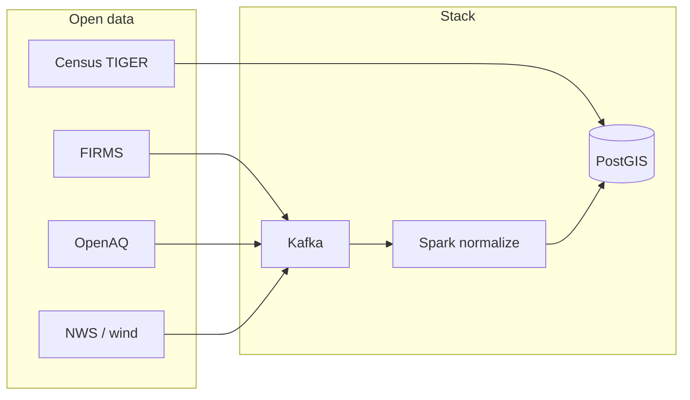

# wildfire-smoke-risk-correlator

**Kafka + Spark + PostGIS** pipeline that correlates **NASA FIRMS** active-fire hotspots and **OpenAQ** particulate measurements with **U.S. Census** county and tract geometries, then publishes an **engineering smoke-risk index** and optional plume, dispersion-style proxy, calibration, and alerting surfaces.

> **Warning — non-claims:** This project is **not** a public-health advisory system, **not** regulatory dispersion or compliance air-quality modeling, and **not** operational emergency guidance. It is an **engineering / research platform** using **open data** and inspectable SQL — for local reproducible experimentation, not clinical or regulatory claims.

**Full documentation (MkDocs + Material):** [Documentation site](https://sempervent.github.io/wildfire-smoke-risk-correlator/) — available after [enabling GitHub Pages](docs/release/v1.1.0.md#enable-github-pages-manual-once-per-repo) (GitHub Actions source). Browse sources under [`docs/`](docs/index.md). Locally: **`make docs-serve`** (theme + custom stylesheet under **`docs/stylesheets/`**).

---

## What it does

- **Ingest** FIRMS, OpenAQ, wind, and optional gridded weather into **Kafka**.
- **Normalize** with **Spark** into **`normalized.*`** PostGIS tables with **spatial joins** to **`geo.counties`** / **`geo.tracts`**.
- **Score** configurable-window **smoke risk** (**v1–v5**) into **`analytics.smoke_risk_scores`**; publish snapshots to **`smoke.risk.scores`**.
- **Optional** corridor **plume** (**`wind_v1`**, **`wind_grid_v2`**) and **Gaussian proxy dispersion** (**`gaussian_v0`**) — engineering heuristics only.
- **Calibration / evaluation** scaffolding (observations, dispersion–AQ comparisons, evaluation batches) — **not** validated science.
- **Alerting** via **`analytics.fn_alert_candidates`**, materialized **`analytics.alert_events`**, and notifiers; **runbooks** in **`docs/runbooks/`**.
- **DLQs and replay** with **`analytics.parse_errors`** and replay scripts (**`DRY_RUN`** defaults).
- **Grafana** optional profile for maps and ops tables.

Wind uses the meteorological convention (**wind FROM**); transport uses the **opposite bearing** — see `src/wildfire_smoke/wind.py`.

## Architecture (summary)



More detail: **[Architecture overview](docs/architecture/overview.md)** · **[Data flow](docs/architecture/dataflow.md)**

## Quickstart (no secrets)

```bash
cp .env.example .env
make deps
make up && make topics && make db-bootstrap   # or: make db-bootstrap-minimal
```

Fixture demo (no live NASA/OpenAQ keys):

```bash
export FIRMS_DRY_RUN=1 OPENAQ_DRY_RUN=1 WIND_DRY_RUN=1
make ingest-once    # or: make replay-fixtures / make demo
make normalize && make compute-risk
```

## Quickstart (full local stack)

Same as above; use **`make smoke-test`** for a broad Compose-backed check. Fast CI-style checks without Docker:

```bash
SMOKE_NO_COMPOSE=1 bash scripts/smoke_test.sh
```

## Data sources

| Source | Role |
|--------|------|
| **NASA FIRMS** | Hotspots (live API key or fixtures) |
| **OpenAQ v3** | AQ measurements |
| **U.S. Census TIGER/Line** | County/tract boundaries |
| **NWS** | Wind / gridpoint weather (bounded configs) |

## Operating modes

| Mode | When |
|------|------|
| **Fixture / demo** | `*_DRY_RUN=1`, `make replay-fixtures`, `make demo` |
| **Live bounded ingest** | Keys set; respect bbox / station limits in **`.env.example`** |
| **Integration regression** | `make integration-regression` (long; fixtures + Spark) |
| **Calibration export** | `make export-calibration` → `artifacts/calibration/<stamp>/` |

## Common Make targets

| Command | Purpose |
|---------|---------|
| `make deps` | Install Python deps |
| `make up` / `make topics` | Compose stack + Kafka topics |
| `make db-bootstrap` | Census + SQL migrations/views |
| `make normalize` / `make compute-risk` | Core batch jobs |
| `make grafana-up` | Optional dashboards |
| `make docs` / `make docs-serve` | Build or serve MkDocs site locally |
| `make docs-check` | **`mkdocs build --strict`** (CI gate) |
| `make release-check` | Maintainer gate (lint, tests, docs, smoke) |
| `make db-doctor` | Postgres structural / drift checks |
| `make repair-alert-function` | Fix legacy `fn_alert_candidates` overload drift |

Extended tables: **[Make targets reference](docs/reference/make-targets.md)**

## Troubleshooting

| Issue | What to try |
|-------|-------------|
| **`fn_alert_candidates` is not unique** | `make repair-alert-function` then `make db-doctor` |
| Missing views / migrations | `make db-bootstrap` or `make db-bootstrap-minimal` |
| Stale fixtures vs alerts | `ALERTS_WARN_ONLY=1` or widen thresholds |
| Spark / JDBC | See **`scripts/run_normalize.sh`** — **`PSYCOPG_CONNINFO`**, **`KAFKA_BOOTSTRAP_SERVERS`** |

Full guide: **[Troubleshooting](docs/operations/troubleshooting.md)** · **`docs/release/v1.0.1.md`** (overload repair)

## Project layout

| Path | Contents |
|------|----------|
| **`docs/`** | MkDocs source (user docs) |
| **`sql/migrations/`**, **`sql/views/`** | DDL / views |
| **`scripts/`** | Shell entrypoints |
| **`src/wildfire_smoke/`** | Python package |
| **`docker/`** | Compose images, Grafana, Postgres initdb |

## License

See **`LICENSE`**.
