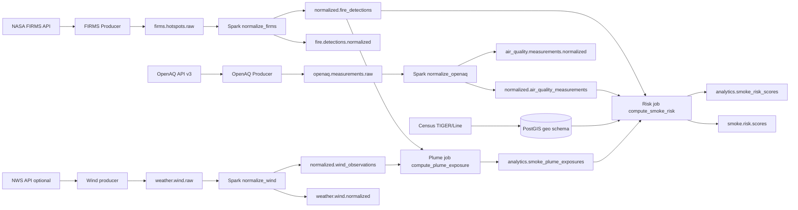

# wildfire-smoke-risk-correlator

This repository implements a **Kafka + Spark + PostGIS** pipeline that correlates **NASA FIRMS active-fire hotspots** and **OpenAQ PM measurements** (PM2.5 and PM10-style parameters) to **U.S. Census county and tract geometries**, then publishes an **engineering smoke-risk index** per county/tract for a recent time window.

**Phase 2** adds **ingestion run tracking** in Postgres, **risk model v2** with JSON explanations and spatial nearby-fire signal, **SQL views** for Grafana-friendly analytics, **`make quality-check`** / **`make replay-fixtures`**, and **optional Grafana** dashboards (Compose profile `grafana`).

**Phase 3** adds **GeoJSON / centroid presentation views** for maps (`analytics.v_latest_smoke_risk_*_geojson`, point GeoJSON for fires/AQ), **Grafana geomap panels** (centroid markers; GeoJSON preview tables for polygons), **SLI views + `analytics.fn_alert_candidates`**, **`make alerts-check`** (thresholds via `ALERT_*` env vars), **multi-state census bootstrap** (`CENSUS_STATEFPS`, optional national counties), **materialized snapshots** + **`make refresh-mviews`**, and **`make demo`** as a **no-secrets** local walkthrough.

**Phase 4** adds **`analytics.alert_events`** (stable fingerprints + deduped open incidents), **`make alerts-materialize`** / **`make alerts-send`** with **console / webhook / Slack / SMTP** notifiers, **operator runbooks** under `docs/runbooks/`, **bounded `make ingest-live-once`** (requires `FIRMS_MAP_KEY`; rejects huge bboxes unless explicitly allowed), and **`make operational-cycle`** for a repeatable fixture or live loop.

**Phase 5** adds **`analytics.notification_attempts`** (durable delivery audit with **destination hashes**, safe errors, **retry_after**), **retry/backoff + max attempt caps**, **`make alerts-send-digest`** / **`make alerts-send-retry`**, **`analytics.operational_runs`** instrumentation from **`scripts/run_operational_cycle.sh`**, **operator evidence SQL views** (wired into Grafana tables), an **optional Compose `scheduler` profile** (`operational-scheduler` using **Docker CLI + socket**—treat as advanced), and **systemd unit/timer templates** under `deploy/systemd/`.

**Phase 6** adds **bounded wind observation ingestion** (`weather.wind.raw` → **`normalized.wind_observations`**), a **`wind_v1` corridor plume approximation** into **`analytics.smoke_plume_exposures`** (**not** dispersion modeling), **smoke risk model `v3`** (blends the existing **v2** base score with max plume exposure), **SQL transport views** (`analytics.v_latest_wind_observations*`, `analytics.v_smoke_transport_summary`, …), **Grafana wind/plume panels**, and **alert candidates** `wind_data_stale`, `no_recent_wind_data`, `high_plume_exposure` with runbooks.

**Phase 7** adds **durable parse-error quarantine** (`analytics.parse_errors`), **Spark normalizer offset evidence** (`analytics.kafka_consumer_offsets`; distinct from broker-internal committed offsets unless unified later), **source-specific Kafka DLQs** plus a shared **`normalization.errors`** stream, **`make replay-bad-fixtures`** / **`make replay-dlq`** ( **`DRY_RUN=1` default** ), **`make dlq-smoke-test`** (bad fixtures + normalize + assertions), expanded **`make quality-check`** / **`make smoke-test`** hooks, **SQL + Grafana operational views**, and alert candidates **`parse_errors_high`**, **`parser_failure_spike`**, **`dlq_records_present`**, **`consumer_offset_stale`** with runbooks.

Wind direction uses the **meteorological convention** (*wind FROM*); modeled smoke transport uses the **opposite bearing** (see `src/wildfire_smoke/wind.py`).

**Important:** the risk score is a **demonstration / operations correlation index**, not a health advisory model.

## What this project does

- **Ingest** FIRMS CSV hotspot rows into Kafka (`firms.hotspots.raw`).
- **Ingest** OpenAQ v3 measurements into Kafka (`openaq.measurements.raw`).
- **Ingest** wind observations into Kafka (`weather.wind.raw`; fixtures via **`WIND_DRY_RUN=1`**, or bounded **NWS** adapter via **`WIND_STATION_IDS`**).
- **Normalize** Kafka messages into PostGIS tables (`normalized.*`) using Spark batch jobs, including **spatial association** to `geo.counties` / `geo.tracts`.
- **Compute** configurable-window risk scores into `analytics.smoke_risk_scores` (models **v1**, **v2**, and optional **`v3`**) and publish JSON snapshots to Kafka (`smoke.risk.scores`).
- **Compute** optional **`wind_v1` plume corridor exposures** (`make compute-plume`) for geography-linked smoke-transport visualization (engineering heuristic only).
- **Bootstrap** county + tract boundaries from Census TIGER/Line (default **Tennessee**; optional **multi-state** or **national county** load via env — see below).

## Architecture



## Quickstart (local)

### Prerequisites

- Docker + Docker Compose
- `uv` (recommended) or another Python 3.11+ toolchain
- `bash`, `curl`, `unzip`

### Configure environment

Copy `.env.example` to `.env` and fill in secrets as needed:

- **Live FIRMS ingestion** requires `FIRMS_MAP_KEY` (never commit it).
- **OpenAQ** may require `OPENAQ_API_KEY` depending on current API access behavior.

### Bring the stack up

```bash
make up
```

### Create Kafka topics

```bash
make topics
```

### Bootstrap PostGIS + Census boundaries (Tennessee by default)

```bash
make db-bootstrap
```

This downloads shapefiles into `data/raw/census/`, loads them via `ogr2ogr` (see `gdal-utils` profile in `docker-compose.yml`), validates counts/SRID/indexes, applies **idempotent SQL migrations** under `sql/migrations/`, then reapplies SQL views from `sql/views/`.

### Run validation

Unit tests:

```bash
make deps
make test
```

End-to-end smoke checks (Postgres + topics + **explicit fixture dry-run producers** + views + Spark risk job):

```bash
make smoke-test
```

### Run one ingestion cycle

Live ingestion (requires keys + network):

```bash
make ingest-once
```

**Explicit fixture dry-run path** (no NASA/OpenAQ network calls; uses checked-in fixtures under `tests/fixtures/`):

```bash
export FIRMS_DRY_RUN=1
export OPENAQ_DRY_RUN=1
# Optional overrides:
# export FIRMS_FIXTURE_CSV=tests/fixtures/firms_sample.csv
# export OPENAQ_FIXTURE_JSONL=tests/fixtures/openaq_sample.jsonl
make ingest-once
```

### Normalize Kafka → PostGIS + publish normalized topics

```bash
make normalize
```

### Compute smoke risk

Runs the Python risk job in the Spark container (defaults: **v2** model, **24h** lookback, **50 km** nearby-fire radius, **both** county and tract). Override via environment (also respected when exported before `make compute-risk`):

- `SMOKE_RISK_MODEL_VERSION` — `v1` or `v2` (default `v2`)
- `SMOKE_RISK_LOOKBACK_HOURS` — default `24`
- `SMOKE_RISK_NEARBY_KM` — default `50`
- `SMOKE_RISK_GEOGRAPHIES` — `county`, `tract`, or `both`

```bash
make compute-risk
```

### Replay fixtures (no API keys)

Publishes checked-in FIRMS/OpenAQ fixtures to Kafka and optionally runs normalization + risk (defaults **on**):

```bash
make replay-fixtures
```

Disable downstream steps with `REPLAY_RUN_NORMALIZE=0` and/or `REPLAY_RUN_COMPUTE=0`.

### Data quality check

Structural failures (missing tables, invalid census geometries, duplicate normalized IDs, unreachable DB) exit non-zero. Soft issues (empty tables, stale timestamps, unmatched geoids) emit warnings only.

```bash
make quality-check
```

### Grafana (optional)

```bash
make grafana-up
```

- UI: `http://localhost:3001` (override with `GRAFANA_PORT`; default **3001** avoids clashes with apps on `:3000`).
- Login defaults: `GRAFANA_ADMIN_USER` / `GRAFANA_ADMIN_PASSWORD` (`admin` / `admin` unless overridden).
- Postgres datasource and dashboard JSON are provisioned from `docker/grafana/provisioning/` and `docker/grafana/dashboards/smoke-risk.json`.
- **Maps (Phase 3):** county / tract **risk markers at centroids** (geomap), fire and AQ **point maps**, plus **GeoJSON preview** tables (truncated text). Canonical polygons remain in `geo.*`; dashboard views are documented as presentation-only.
- **Tables:** top 20 risk areas, ingestion runs, source freshness, data quality summary.
- **Limitation:** native GeoJSON polygon fills from Postgres in Grafana can be finicky in provisioned JSON; this dashboard favors **reliable marker maps + GeoJSON snippets** over brittle polygon layers.

### Alerting / SLIs (SQL-first)

- **Views:** `analytics.v_sli_*` surface ingestion failures, freshness ages, sparse recent rows, and high-risk rows.
- **Candidates:** `analytics.fn_alert_candidates(warn_h, crit_h, risk_min, lookback_h, high_plume_min, parse_err_warn, parse_err_crit, offset_stale_h)` unions actionable rows; `analytics.v_alert_candidates` uses defaults `(6, 24, 75, 24, 70, 1, 25, 6)` for the Phase 7 tail (override via env in `scripts/check_alerts.sh`).
- **CLI:** `make alerts-check` prints candidates and exits **2** if any **`severity = critical`** exists. Set **`ALERTS_WARN_ONLY=1`** to always exit 0 (recommended for fixture demos where timestamps are intentionally stale).
- **Threshold env:** `ALERT_FRESHNESS_WARN_HOURS` (default 6), `ALERT_FRESHNESS_CRITICAL_HOURS` (24), `ALERT_HIGH_RISK_MIN_SCORE` (75), `ALERT_LOOKBACK_HOURS` (24), `ALERT_HIGH_PLUME_EXPOSURE_MIN_SCORE` (70), `ALERT_PARSE_ERRORS_WARN_COUNT` (1), `ALERT_PARSE_ERRORS_CRITICAL_COUNT` (25), `ALERT_CONSUMER_OFFSET_STALE_HOURS` (6).

### Phase 4 — persisted alerts, notifications, bounded live ingest

**Lifecycle**

1. SQL surfaces candidates (`fn_alert_candidates` / `v_alert_candidates`).
2. `make alerts-materialize` reads candidates, computes a stable **fingerprint** per logical incident, and **upserts** `analytics.alert_events` (refreshing `last_seen_at` while `status` is `open`/`acknowledged`).
3. `make alerts-send` delivers **open** rows through the selected notifier and records per-notifier metadata inside `notification_state` JSON (skipping repeats unless **`FORCE_NOTIFY=1`**).
4. Optional `ALERTS_RESOLVE_MISSING=1` resolves **open** rows whose fingerprints disappear from the latest candidate set (use carefully with oscillating fixture data).

**Deduping**

- Partial unique index on **`fingerprint`** while `status IN ('open','acknowledged')` prevents duplicate active incidents.
- Fingerprints **exclude** wall-clock `observed_at`; they combine normalized severity, geography keys, alert type, and small stable details (e.g., ingestion `source`, smoke-risk `model_version`/`risk_band`).

**Materialize env**

- `ALERTS_DRY_RUN=1` — print planned upserts without writes.
- `ALERTS_RESOLVE_MISSING=1` — auto-resolve stale open incidents missing from the candidate snapshot.

**Notifier env**

- `ALERT_NOTIFIER` — `console` (default), `webhook`, `slack`, `smtp` / `email`.
- `ALERT_SEVERITY_MIN` — `info`, `warning`, `high`, `critical` (default **`high`**). SQL `warn` maps to `warning`, except **`high_smoke_risk` warn → `high`**.
- `ALERT_LIMIT` — max rows scanned from open incidents (default **20**).
- `FORCE_NOTIFY=1` — bypass “already sent for this `last_seen_at`” suppression.
- Webhook: `ALERT_WEBHOOK_URL`, optional `ALERT_WEBHOOK_HEADERS_JSON` (object JSON for extra headers).
- Slack incoming webhook: `SLACK_WEBHOOK_URL`.
- SMTP: `SMTP_HOST`, `SMTP_PORT`, `SMTP_USER`, `SMTP_PASSWORD`, `ALERT_EMAIL_FROM`, `ALERT_EMAIL_TO`.

**Bounded live ingest**

```bash
export FIRMS_MAP_KEY=...           # required
export OPENAQ_API_KEY=...          # optional depending on tenant behavior
export LIVE_INGEST_BBOX=-88.2,34.9,-81.6,36.7   # Tennessee-ish default inside the script
make ingest-live-once
```

- Refuses bbox spans larger than **`LIVE_INGEST_MAX_SPAN_DEG`** (default **14°**) unless **`LIVE_INGEST_ALLOW_LARGE_BBOX=1`**.
- Prints bbox sources **without secrets**, then runs producers → normalize → compute-risk → quality-check → materialize → console send (override notifier via env).

**Operational cycle**

```bash
# Fixture/no-secrets path (default): replay producers only, then batch jobs + alerts
make operational-cycle LIVE_MODE=0 ALERT_NOTIFIER=console

# Live bounded path (requires FIRMS_MAP_KEY + acceptable bbox)
make operational-cycle LIVE_MODE=1
```

`LIVE_MODE=0` defaults `ALERTS_WARN_ONLY=1` for downstream tooling consistency (the cycle itself runs quality-check + alert materialization rather than `alerts-check`).

Phase 5 records each fixture/live cycle into **`analytics.operational_runs`** with JSON **`steps`** (names/status/timestamps only—no secrets).

### Phase 5 — notification reliability, digest, scheduling

**Attempts table**

- Each delivery creates rows in **`analytics.notification_attempts`** (`succeeded` / `failed` / `skipped`).
- **`destination_hash`** hashes a normalized destination descriptor (never store raw webhook URLs or SMTP passwords).
- Failures record **`error_class`** + truncated **`error_message`** safe for logs.

**Retries**

- Backoff after failures: **5m**, then **15m**, then **60m** (`retry_after` column).
- **`ALERT_RETRY_DISABLED=1`** skips backoff gating (still enforces **`ALERT_MAX_ATTEMPTS`** unless you adjust workflow).
- **`ALERT_MAX_ATTEMPTS`** (default **5**) counts non-`skipped` attempts per `(alert_event_id, notifier)`.
- **`FORCE_NOTIFY=1`** bypasses “already sent for this `last_seen_at`” suppression via `notification_state`, but attempts are still logged.

**Digest mode**

- **`make alerts-send-digest`** sets **`ALERT_DIGEST=1`** and **`--digest`** (single summarized message per notifier invocation).
- **`ALERT_DIGEST_WINDOW_HOURS`** (default **24**) filters digest inclusion by `observed_at`.
- **`ALERT_DIGEST_MAX_ITEMS`** caps digest cardinality (default **50**).
- Digest output calls out **severity counts**, **newest observed time**, **titles**, **geographies**, and **runbook slugs**, and explicitly tells operators to verify criticals in SQL—not a substitute for paging critical incidents.

**Retry queue mode**

- **`make alerts-send-retry`** sets **`ALERT_RETRY_QUEUE=1`** + **`--retry-queue`**, targeting alerts whose **latest** attempt for that notifier was **`failed`** (fresh retries still obey backoff unless disabled).

**Rate limiting / cooldown**

- **`ALERT_SEND_COOLDOWN_SECONDS`** (default **0**) suppresses *all* sends for a notifier if the latest attempt was within the cooldown window.

**Scheduling**

- **Recommended:** install `deploy/systemd/wildfire-smoke-operational.{service,timer}` on a host with Docker/Compose access, editing **`WorkingDirectory`** / **`EnvironmentFile`** to your checkout.
- **Optional Compose:** `make operational-scheduler-up` starts **`operational-scheduler`** (`--profile scheduler`). It mounts **`/var/run/docker.sock`** and periodically `docker compose exec`s `spark-worker` to run `scripts/run_operational_cycle.sh` (fixture mode by default; set **`LIVE_MODE=1`** explicitly for live). This is **disabled by default** and should be treated as an advanced integration.

**Grafana**

- Dashboard panels query **`analytics.v_open_alert_events`**, **`v_notification_attempt_summary`**, **`v_notification_failures`**, **`v_alert_delivery_state`**, and **`v_recent_operational_cycles`**.

**Runbooks**

- Human procedures live under `docs/runbooks/` and are mapped from `alert_type` via `config/runbooks.yaml` into `alert_events.runbook_slug`.

### Materialized views (optional performance)

- **`analytics.mv_latest_smoke_risk_by_{county,tract}`** and **`analytics.mv_latest_smoke_risk_{county,tract}_geojson`** mirror the latest/geo views with **unique indexes** for `REFRESH MATERIALIZED VIEW CONCURRENTLY`.
- Refresh after large loads: `make refresh-mviews` (runs `scripts/refresh_materialized_views.sh`).
- Prefer plain **views** for simplicity locally; use **materialized** copies when map queries feel heavy.

### Multi-state census bootstrap

Defaults stay **Tennessee-only** to keep downloads small.

| Env | Behavior |
|-----|----------|
| `CENSUS_STATEFP=47` | Single state (overrides yaml default when set). |
| `CENSUS_STATEFPS=47,37,21` | Multiple states: **tract zip per state**; counties from **one national county file** filtered to those FIPS (unless national-full flag below). |
| `CENSUS_LOAD_NATIONAL_COUNTIES=1` | Load **all US counties** (large); tracts still limited to selected states. Validation expects **≥ `min_counties_national_us`** (see `config/census.yaml`). |

Row counts per state are printed after load (`GROUP BY statefp`). Scripts remain **idempotent** (truncate `geo.*` + reload staging).

### One-command demo (no API keys)

```bash
make demo
```

Runs `up`, `db-bootstrap`, `topics`, `replay-fixtures`, `normalize`, `compute-plume`, `compute-risk`, `quality-check`, optional `refresh-mviews` (`DEMO_REFRESH_MVIEWS=0` to skip), then prints **Grafana / Console / Spark / psql** hints. Uses **`FIRMS_DRY_RUN` / `OPENAQ_DRY_RUN` / `WIND_DRY_RUN`** inside `replay-fixtures`; never requires live keys.

### Reset everything (destructive)

```bash
make reset
```

This wipes the Postgres volume, recreates topics, re-downloads Census data for the configured state/year fallback list, reloads boundaries, and reapplies SQL views.

## Phase 7 — parse errors, DLQs, and replay safety

**Postgres**

- **`analytics.parse_errors`**: one row per logical open failure (`payload_hash` + `error_class` + consumer group + topics), with rolling **`occurrence_count`** and JSONB **`payload_sample`** / **`error_context`** (no secrets; oversized payloads are truncated in helpers under `src/wildfire_smoke/dlq.py`).
- **`analytics.kafka_consumer_offsets`**: last processed / success / error offsets per **`(consumer_group, topic, partition)`** written by Spark normalizers as **evidence**, not as a replacement for Kafka’s internal consumer group commits.

**Kafka**

- **Per-source DLQs:** `firms.hotspots.dlq`, `openaq.measurements.dlq`, `weather.wind.dlq`.
- **Fan-in diagnostics:** `normalization.errors` receives the same envelope as the source DLQ (operators can subscribe once for all normalizers).

**Envelope (published JSON)**

- Includes `source_topic`, `target_dataset`, `consumer_group`, `original_key`, `original_partition`, `original_offset`, `payload_hash`, `error_class`, `error_message`, `error_context`, **`original_payload`** (sanitized/truncated), and `failed_at`.

**Workflows**

- **`make replay-bad-fixtures`**: publishes intentionally malformed CSV/JSONL fixtures to raw topics (no API keys).
- **`make replay-dlq`**: reads **`analytics.parse_errors`** by default (`DLQ_SOURCE_MODE=postgres`) or a DLQ topic (`DLQ_SOURCE_MODE=kafka`); defaults to **`DRY_RUN=1`**. Filter with **`SOURCE_TOPIC`**, **`TARGET_DATASET`**, **`STATUS`**, **`DLQ_REPLAY_LIMIT`**. Optional **`DLQ_RESOLVE_ON_REPLAY=1`** marks replayed Postgres rows **`resolved`** when not dry-running.
- **`make dlq-smoke-test`**: `replay-bad-fixtures` → full **`make normalize`** → asserts **`parse_errors`** gained rows → dry-run **`replay-dlq`** → compiles Phase 7 views.
- **`make smoke-test`**: lightweight Phase 7 checks (topics, tables, views, `replay-bad-fixtures`, **`replay-dlq` dry-run`). Set **`DLQ_SMOKE=1`** to chain **`dlq-smoke-test`** after the standard smoke path (slower; exercises Spark on poison messages).

**Quality / alerts**

- **`make quality-check`** fails if Phase 7 tables or DLQ topics are missing; warns on open parse errors, 24h parse-error counts, and missing Spark offset-evidence rows.
- New alert runbooks live under `docs/runbooks/parse-errors-high.md` (and related filenames); mappings are in `config/runbooks.yaml`.

**Known limitations**

- Postgres replay uses **`payload_sample`** (may be truncated); Kafka DLQ replay uses **`original_payload`** from the envelope when available.
- **`consumer_offset_stale`** warns when **no** `spark-normalize%` evidence exists yet (common before the first successful normalization on a fresh volume).

## Makefile targets

| Target          | Purpose                                              |
|-----------------|------------------------------------------------------|
| `make deps`     | Install Python deps (including dev/test extras)      |
| `make up`       | Start Postgres + Redpanda + Console + Spark          |
| `make down`     | Stop stack (keeps volumes unless you remove them)    |
| `make reset`    | Full local wipe + rebuild + census bootstrap         |
| `make topics`   | Create required Kafka topics                         |
| `make db-bootstrap` | Download/load Census + apply SQL views         |
| `make ingest-once`  | Run FIRMS + OpenAQ + wind producers once           |
| `make normalize`    | Run Spark normalization jobs (FIRMS + OpenAQ + wind) |
| `make normalize-wind` | Spark-normalize **`weather.wind.raw`** only       |
| `make compute-plume` | **`wind_v1` corridor exposures** (PostGIS job)    |
| `make compute-risk`   | Run Python smoke-risk job (in Spark container)   |
| `make replay-fixtures`| Fixture Kafka publish + normalize + plume + risk |
| `make replay-wind-fixtures` | Publish **`WIND_DRY_RUN`** wind fixture + normalize-wind |
| `make replay-bad-fixtures` | Publish **malformed** FIRMS/OpenAQ/wind fixtures (no API keys) |
| `make replay-dlq` | **`scripts/replay_dlq.sh`** — DLQ / `parse_errors` replay (**`DRY_RUN=1` default**) |
| `make dlq-smoke-test` | Bad fixtures + normalize + assert **`parse_errors`** + dry-run replay |
| `make parse-errors` | Print **`analytics.v_parse_error_summary`** |
| `make consumer-offsets` | Print **`analytics.v_consumer_offset_state`** |
| `make smoke-transport-demo` | Replay fixtures + optional **`SMOKE_RISK_MODEL_VERSION=v3`** risk pass |
| `make quality-check`  | DB / geometry / duplicate-ID structural checks   |
| `make grafana-up`     | Start Grafana (`--profile grafana`)              |
| `make refresh-mviews` | `REFRESH MATERIALIZED VIEW CONCURRENTLY` snapshots |
| `make alerts-check`   | Print alert candidates; fail on **critical**    |
| `make alerts-materialize` | Upsert `analytics.alert_events` from candidates |
| `make alerts-send`    | Dispatch notifier for open incidents             |
| `make alerts-send-digest` | Send one digest notification per notifier   |
| `make alerts-send-retry` | Retry-queue filter (`last attempt failed`) |
| `make ingest-live-once` | Bounded live producers + pipeline + alerts    |
| `make operational-cycle` | Fixture replay **or** live ingest + batch jobs |
| `make operational-scheduler-up` | Start Compose **`scheduler`** profile loop |
| `make demo`           | No-secrets local demo (`replay-fixtures` path)   |
| `make smoke-test`   | Run `scripts/smoke_test.sh`                      |
| `make test`     | Run pytest                                           |

## Inspecting Kafka topics

- **CLI**:

```bash
docker compose exec -T redpanda rpk topic consume firms.hotspots.raw --brokers 127.0.0.1:9092 --num 5
```

- **UI**: Redpanda Console is exposed on `http://localhost:8088` by default.
- **Spark UI**: Spark Master web UI is exposed on `http://localhost:8091` by default.

## Inspecting PostGIS tables

```bash
docker compose exec -T postgres psql -U smoke -d smoke -c "SELECT COUNT(*) FROM normalized.fire_detections;"
docker compose exec -T postgres psql -U smoke -d smoke -c "SELECT COUNT(*) FROM normalized.air_quality_measurements;"
docker compose exec -T postgres psql -U smoke -d smoke -c "SELECT COUNT(*) FROM analytics.smoke_risk_scores;"
```

Example analytical queries ship under `sql/queries/` (including **latest ingestion runs** and **source freshness**).

Stable analytics views for dashboards include:

- `analytics.v_latest_smoke_risk_by_county`, `analytics.v_latest_smoke_risk_by_tract`
- `analytics.v_top_smoke_risk_areas`
- `analytics.v_latest_fire_detections`, `analytics.v_latest_air_quality_measurements`
- `analytics.v_ingestion_run_status`, `analytics.v_source_freshness`
- `analytics.v_data_quality_summary`
- **Phase 3 maps:** `analytics.v_latest_smoke_risk_county_geojson`, `analytics.v_latest_smoke_risk_tract_geojson`, `analytics.v_latest_fire_detections_geojson`, `analytics.v_latest_air_quality_geojson`
- **Phase 6 transport:** `analytics.v_latest_wind_observations`, `analytics.v_latest_wind_observations_geojson`, `analytics.v_latest_smoke_plume_exposures`, `analytics.v_top_plume_exposures`, `analytics.v_latest_smoke_risk_v3`, `analytics.v_smoke_transport_summary`
- **Phase 7 DLQ / offsets:** `analytics.v_parse_errors_open`, `analytics.v_parse_error_summary`, `analytics.v_parse_errors_recent`, `analytics.v_consumer_offset_state`, `analytics.v_dlq_operational_summary`
- **Phase 3 SLIs / alerts:** `analytics.v_sli_*`, `analytics.v_alert_candidates`, `analytics.fn_alert_candidates(...)`

Producer runs append rows to **`analytics.ingestion_runs`** (`run_id`, `source`, `mode` `live|dry_run`, counts, `config` JSON without secrets, `error_message` on failure).

## Data sources

- **NASA FIRMS (CSV by area)**: `https://firms.modaps.eosdis.nasa.gov/api/area/csv/{MAP_KEY}/{SOURCE}/{AREA}/{DAY_RANGE}`
  - Default source: `VIIRS_SNPP_NRT` (override via `FIRMS_SOURCE`)
  - Default bbox: `-125,24,-66,50` (override via `FIRMS_BBOX`)
- **OpenAQ v3**: `https://api.openaq.org/v3` (locations → sensors → measurements)
- **Census TIGER/Line**: `https://www2.census.gov/geo/tiger/...` (see `scripts/download_census_boundaries.sh`)

## Risk score (engineering index)

Both models share the same **bands**:

- **low**: \([0, 25)\)
- **moderate**: \([25, 50)\)
- **high**: \([50, 75)\)
- **severe**: \([75, 100]\)

### Model v1 (legacy composite)

Uses FIRMS rows joined on **`county_geoid` / `tract_geoid`** and AQ averages over the same geography keys in the window.

- \(fire\_component = \min(1, fire\_count / 20)\)
- \(frp\_component = \min(1, max\_frp / 500)\) (null treated as 0)
- \(pm25\_component = \min(1, \max(avg\_pm25 - 5, 0) / 50)\)
- \(pm10\_component = \min(1, \max(avg\_pm10 - 10, 0) / 100)\)

\[
risk\_score = 100 \cdot (0.35\, fire + 0.25\, frp + 0.30\, pm25 + 0.10\, pm10)
\]

### Model v2 (spatial + explainability)

Uses **fires inside** the census polygon vs **within `SMOKE_RISK_NEARBY_KM`**, **max FRP** among contributing fires, AQ averages tied to `county_geoid`/`tract_geoid`, and **fire recency** vs the scoring window end. Component weights:

\[
risk\_score = 100 \cdot (
  0.25\, fire\_{inside} + 0.20\, nearby\_{fire} + 0.15\, frp + 0.25\, pm25 + 0.05\, pm10 + 0.10\, recency
)\]

Recency maps hours since the newest contributing fire to \(1.0 / 0.75 / 0.50 / 0.25 / 0\) at 3h / 6h / 12h / 24h thresholds. Each v2 row stores an **`explanation` JSONB** with inputs, per-component values, weights, and `hours_since_newest_fire`.

### Model v3 (plume-aware blend)

Computes the **same spatial/AQ inputs as v2**, then blends in **`wind_v1` plume exposure** (max score per geography/window from **`analytics.smoke_plume_exposures`**):

\[
plume\_{component} = \min\left(1,\frac{max\_{plume}}{100}\right),\quad
risk\_{score} = \min\left(100,\ 0.75\, base\_{v2} + 25\, plume\_{component}\right)
\]

Run **`SMOKE_RISK_MODEL_VERSION=v1`** or **`=v3`** to compare models on the same clock-aligned window (compute **`make compute-plume`** first so v3’s plume signal is populated when fires/wind align).

## Troubleshooting

- **Spark normalization / JDBC**: executor containers need **`PSYCOPG_CONNINFO`** (or JDBC URL + credentials) and **`KAFKA_BOOTSTRAP_SERVERS`**—see `scripts/run_normalize.sh`. The smoke-risk job uses the same Spark image but runs **`python3`** with psycopg only (`scripts/run_compute_risk.sh`).
- **GDAL / census paths**: the `gdal-utils` profile mounts `./data/raw/census` at **`/data/census`** inside the container; loaders write under `data/raw/census/` on the host.
- **County download fallback**: if a state county zip is missing for a TIGER year, the downloader uses the **national county file** and filters by **`STATEFP`** during load (see `scripts/download_census_boundaries.sh`).
- **Ingestion runs require Postgres**: producers open a DB connection to create/update **`analytics.ingestion_runs`**; ensure Postgres is up and migrations have been applied (`make db-bootstrap`).
- **Grafana port**: if `make grafana-up` fails to bind, set **`GRAFANA_PORT`** to a free host port.

## Known limitations

- **Wind live adapter**: bounding-box station discovery is **not implemented** in v1 — set **`WIND_STATION_IDS`** (comma-separated ICAO ids) for live NWS pulls; respect NWS **`User-Agent`** guidance via **`NWS_USER_AGENT`**.
- **`wind_v1` plume rows** require overlapping **fire detections**, **wind directions**, and census geometries — fixture demos may legitimately yield **zero** `analytics.smoke_plume_exposures` rows if timestamps/geometries do not intersect.
- **Alert overlap**: an empty wind table can surface **both** `wind_data_stale` and `no_recent_wind_data`—similar to the FIRMS/OpenAQ freshness/no-row pairing.
- **Grafana polygon provisioning**: centroid marker maps are the supported default; full GeoJSON polygon styling may require manual panel tuning beyond checked-in JSON.
- **`make alerts-check` with fixtures**: checked-in FIRMS/OpenAQ timestamps are often outside freshness windows — expect **critical** staleness rows unless you widen thresholds or set **`ALERTS_WARN_ONLY=1`**.
- **National counties**: `CENSUS_LOAD_NATIONAL_COUNTIES=1` downloads and loads **all** US counties — intentionally heavy; not the default.
- **Coverage vs geography bootstrap**: FIRMS/OpenAQ defaults use a **continental U.S. bbox**, while census geometries default to **Tennessee** for manageable local downloads. Points outside the loaded state will not resolve `county_geoid` / `tract_geoid`.
- **OpenAQ parameter IDs** can evolve; defaults are configured in `config/sources.yaml`.
- **Spark jobs are batch** (`earliest` → `latest` offsets per run), not a continuously committed streaming deployment.
- **Risk inputs** require sufficient recent normalized rows; the smoke test explicitly validates the risk job **runs even when the window is empty**.
- **`make operational-cycle`**: runs Spark normalization + risk jobs — expect **minutes** locally; `scripts/smoke_test.sh` sanity-checks the shell entrypoints via `bash -n` while pytest covers notifier/bbox helpers without rerunning the full Compose loop every time.
- **Notifier secrets**: never log `SMTP_PASSWORD`, webhook URLs, or API keys — failures must redact URLs to host-only where practical.

## Next steps

- Expand census bootstrap to multi-state or national coverage with partitioned loading.
- Replace batch Kafka reads with committed Structured Streaming + DLQ discipline.
- Add Great Expectations / data quality gates on raw vs normalized row counts.
- Wire alert persistence into external incident systems (PagerDuty/Opsgenie) with acknowledgement loops.
- Calibrate scoring using labeled smoke/air-quality events (still not a clinical model).

## License

See `LICENSE`.
