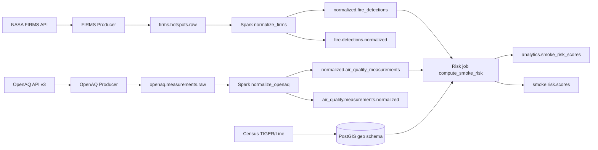

# wildfire-smoke-risk-correlator

This repository implements a **Kafka + Spark + PostGIS** pipeline that correlates **NASA FIRMS active-fire hotspots** and **OpenAQ PM measurements** (PM2.5 and PM10-style parameters) to **U.S. Census county and tract geometries**, then publishes an **engineering smoke-risk index** per county/tract for a recent time window.

**Phase 2** adds **ingestion run tracking** in Postgres, **risk model v2** with JSON explanations and spatial nearby-fire signal, **SQL views** for Grafana-friendly analytics, **`make quality-check`** / **`make replay-fixtures`**, and **optional Grafana** dashboards (Compose profile `grafana`).

**Phase 3** adds **GeoJSON / centroid presentation views** for maps (`analytics.v_latest_smoke_risk_*_geojson`, point GeoJSON for fires/AQ), **Grafana geomap panels** (centroid markers; GeoJSON preview tables for polygons), **SLI views + `analytics.fn_alert_candidates`**, **`make alerts-check`** (thresholds via `ALERT_*` env vars), **multi-state census bootstrap** (`CENSUS_STATEFPS`, optional national counties), **materialized snapshots** + **`make refresh-mviews`**, and **`make demo`** as a **no-secrets** local walkthrough.

**Important:** the risk score is a **demonstration / operations correlation index**, not a health advisory model.

## What this project does

- **Ingest** FIRMS CSV hotspot rows into Kafka (`firms.hotspots.raw`).
- **Ingest** OpenAQ v3 measurements into Kafka (`openaq.measurements.raw`).
- **Normalize** Kafka messages into PostGIS tables (`normalized.*`) using Spark batch jobs, including **spatial association** to `geo.counties` / `geo.tracts`.
- **Compute** configurable-window risk scores into `analytics.smoke_risk_scores` (models **v1** and **v2**) and publish JSON snapshots to Kafka (`smoke.risk.scores`).
- **Bootstrap** county + tract boundaries from Census TIGER/Line (default **Tennessee**; optional **multi-state** or **national county** load via env — see below).

## Architecture



## Quickstart (local)

### Prerequisites

- Docker + Docker Compose
- `uv` (recommended) or another Python 3.11+ toolchain
- `bash`, `curl`, `unzip`

### Configure environment

Copy `.env.example` to `.env` and fill in secrets as needed:

- **Live FIRMS ingestion** requires `FIRMS_MAP_KEY` (never commit it).
- **OpenAQ** may require `OPENAQ_API_KEY` depending on current API access behavior.

### Bring the stack up

```bash
make up
```

### Create Kafka topics

```bash
make topics
```

### Bootstrap PostGIS + Census boundaries (Tennessee by default)

```bash
make db-bootstrap
```

This downloads shapefiles into `data/raw/census/`, loads them via `ogr2ogr` (see `gdal-utils` profile in `docker-compose.yml`), validates counts/SRID/indexes, applies **idempotent SQL migrations** under `sql/migrations/`, then reapplies SQL views from `sql/views/`.

### Run validation

Unit tests:

```bash
make deps
make test
```

End-to-end smoke checks (Postgres + topics + **explicit fixture dry-run producers** + views + Spark risk job):

```bash
make smoke-test
```

### Run one ingestion cycle

Live ingestion (requires keys + network):

```bash
make ingest-once
```

**Explicit fixture dry-run path** (no NASA/OpenAQ network calls; uses checked-in fixtures under `tests/fixtures/`):

```bash
export FIRMS_DRY_RUN=1
export OPENAQ_DRY_RUN=1
# Optional overrides:
# export FIRMS_FIXTURE_CSV=tests/fixtures/firms_sample.csv
# export OPENAQ_FIXTURE_JSONL=tests/fixtures/openaq_sample.jsonl
make ingest-once
```

### Normalize Kafka → PostGIS + publish normalized topics

```bash
make normalize
```

### Compute smoke risk

Runs the Python risk job in the Spark container (defaults: **v2** model, **24h** lookback, **50 km** nearby-fire radius, **both** county and tract). Override via environment (also respected when exported before `make compute-risk`):

- `SMOKE_RISK_MODEL_VERSION` — `v1` or `v2` (default `v2`)
- `SMOKE_RISK_LOOKBACK_HOURS` — default `24`
- `SMOKE_RISK_NEARBY_KM` — default `50`
- `SMOKE_RISK_GEOGRAPHIES` — `county`, `tract`, or `both`

```bash
make compute-risk
```

### Replay fixtures (no API keys)

Publishes checked-in FIRMS/OpenAQ fixtures to Kafka and optionally runs normalization + risk (defaults **on**):

```bash
make replay-fixtures
```

Disable downstream steps with `REPLAY_RUN_NORMALIZE=0` and/or `REPLAY_RUN_COMPUTE=0`.

### Data quality check

Structural failures (missing tables, invalid census geometries, duplicate normalized IDs, unreachable DB) exit non-zero. Soft issues (empty tables, stale timestamps, unmatched geoids) emit warnings only.

```bash
make quality-check
```

### Grafana (optional)

```bash
make grafana-up
```

- UI: `http://localhost:3001` (override with `GRAFANA_PORT`; default **3001** avoids clashes with apps on `:3000`).
- Login defaults: `GRAFANA_ADMIN_USER` / `GRAFANA_ADMIN_PASSWORD` (`admin` / `admin` unless overridden).
- Postgres datasource and dashboard JSON are provisioned from `docker/grafana/provisioning/` and `docker/grafana/dashboards/smoke-risk.json`.
- **Maps (Phase 3):** county / tract **risk markers at centroids** (geomap), fire and AQ **point maps**, plus **GeoJSON preview** tables (truncated text). Canonical polygons remain in `geo.*`; dashboard views are documented as presentation-only.
- **Tables:** top 20 risk areas, ingestion runs, source freshness, data quality summary.
- **Limitation:** native GeoJSON polygon fills from Postgres in Grafana can be finicky in provisioned JSON; this dashboard favors **reliable marker maps + GeoJSON snippets** over brittle polygon layers.

### Alerting / SLIs (SQL-first)

- **Views:** `analytics.v_sli_*` surface ingestion failures, freshness ages, sparse recent rows, and high-risk rows.
- **Candidates:** `analytics.fn_alert_candidates(warn_h, crit_h, risk_min, lookback_h)` unions actionable rows; `analytics.v_alert_candidates` uses defaults `(6, 24, 75, 24)`.
- **CLI:** `make alerts-check` prints candidates and exits **2** if any **`severity = critical`** exists. Set **`ALERTS_WARN_ONLY=1`** to always exit 0 (recommended for fixture demos where timestamps are intentionally stale).
- **Threshold env:** `ALERT_FRESHNESS_WARN_HOURS` (default 6), `ALERT_FRESHNESS_CRITICAL_HOURS` (24), `ALERT_HIGH_RISK_MIN_SCORE` (75), `ALERT_LOOKBACK_HOURS` (24).

### Materialized views (optional performance)

- **`analytics.mv_latest_smoke_risk_by_{county,tract}`** and **`analytics.mv_latest_smoke_risk_{county,tract}_geojson`** mirror the latest/geo views with **unique indexes** for `REFRESH MATERIALIZED VIEW CONCURRENTLY`.
- Refresh after large loads: `make refresh-mviews` (runs `scripts/refresh_materialized_views.sh`).
- Prefer plain **views** for simplicity locally; use **materialized** copies when map queries feel heavy.

### Multi-state census bootstrap

Defaults stay **Tennessee-only** to keep downloads small.

| Env | Behavior |
|-----|----------|
| `CENSUS_STATEFP=47` | Single state (overrides yaml default when set). |
| `CENSUS_STATEFPS=47,37,21` | Multiple states: **tract zip per state**; counties from **one national county file** filtered to those FIPS (unless national-full flag below). |
| `CENSUS_LOAD_NATIONAL_COUNTIES=1` | Load **all US counties** (large); tracts still limited to selected states. Validation expects **≥ `min_counties_national_us`** (see `config/census.yaml`). |

Row counts per state are printed after load (`GROUP BY statefp`). Scripts remain **idempotent** (truncate `geo.*` + reload staging).

### One-command demo (no API keys)

```bash
make demo
```

Runs `up`, `db-bootstrap`, `topics`, `replay-fixtures`, `normalize`, `compute-risk`, `quality-check`, optional `refresh-mviews` (`DEMO_REFRESH_MVIEWS=0` to skip), then prints **Grafana / Console / Spark / psql** hints. Uses **`FIRMS_DRY_RUN` / `OPENAQ_DRY_RUN`** inside `replay-fixtures`; never requires live keys.

### Reset everything (destructive)

```bash
make reset
```

This wipes the Postgres volume, recreates topics, re-downloads Census data for the configured state/year fallback list, reloads boundaries, and reapplies SQL views.

## Makefile targets

| Target          | Purpose                                              |
|-----------------|------------------------------------------------------|
| `make deps`     | Install Python deps (including dev/test extras)      |
| `make up`       | Start Postgres + Redpanda + Console + Spark          |
| `make down`     | Stop stack (keeps volumes unless you remove them)    |
| `make reset`    | Full local wipe + rebuild + census bootstrap         |
| `make topics`   | Create required Kafka topics                         |
| `make db-bootstrap` | Download/load Census + apply SQL views         |
| `make ingest-once`  | Run FIRMS + OpenAQ producers once                  |
| `make normalize`    | Run Spark normalization jobs                     |
| `make compute-risk`   | Run Python smoke-risk job (in Spark container)   |
| `make replay-fixtures`| Fixture-only Kafka publish + normalize + risk      |
| `make quality-check`  | DB / geometry / duplicate-ID structural checks   |
| `make grafana-up`     | Start Grafana (`--profile grafana`)              |
| `make refresh-mviews` | `REFRESH MATERIALIZED VIEW CONCURRENTLY` snapshots |
| `make alerts-check`   | Print alert candidates; fail on **critical**    |
| `make demo`           | No-secrets local demo (`replay-fixtures` path)   |
| `make smoke-test`   | Run `scripts/smoke_test.sh`                      |
| `make test`     | Run pytest                                           |

## Inspecting Kafka topics

- **CLI**:

```bash
docker compose exec -T redpanda rpk topic consume firms.hotspots.raw --brokers 127.0.0.1:9092 --num 5
```

- **UI**: Redpanda Console is exposed on `http://localhost:8088` by default.
- **Spark UI**: Spark Master web UI is exposed on `http://localhost:8091` by default.

## Inspecting PostGIS tables

```bash
docker compose exec -T postgres psql -U smoke -d smoke -c "SELECT COUNT(*) FROM normalized.fire_detections;"
docker compose exec -T postgres psql -U smoke -d smoke -c "SELECT COUNT(*) FROM normalized.air_quality_measurements;"
docker compose exec -T postgres psql -U smoke -d smoke -c "SELECT COUNT(*) FROM analytics.smoke_risk_scores;"
```

Example analytical queries ship under `sql/queries/` (including **latest ingestion runs** and **source freshness**).

Stable analytics views for dashboards include:

- `analytics.v_latest_smoke_risk_by_county`, `analytics.v_latest_smoke_risk_by_tract`
- `analytics.v_top_smoke_risk_areas`
- `analytics.v_latest_fire_detections`, `analytics.v_latest_air_quality_measurements`
- `analytics.v_ingestion_run_status`, `analytics.v_source_freshness`
- `analytics.v_data_quality_summary`
- **Phase 3 maps:** `analytics.v_latest_smoke_risk_county_geojson`, `analytics.v_latest_smoke_risk_tract_geojson`, `analytics.v_latest_fire_detections_geojson`, `analytics.v_latest_air_quality_geojson`
- **Phase 3 SLIs / alerts:** `analytics.v_sli_*`, `analytics.v_alert_candidates`, `analytics.fn_alert_candidates(...)`

Producer runs append rows to **`analytics.ingestion_runs`** (`run_id`, `source`, `mode` `live|dry_run`, counts, `config` JSON without secrets, `error_message` on failure).

## Data sources

- **NASA FIRMS (CSV by area)**: `https://firms.modaps.eosdis.nasa.gov/api/area/csv/{MAP_KEY}/{SOURCE}/{AREA}/{DAY_RANGE}`
  - Default source: `VIIRS_SNPP_NRT` (override via `FIRMS_SOURCE`)
  - Default bbox: `-125,24,-66,50` (override via `FIRMS_BBOX`)
- **OpenAQ v3**: `https://api.openaq.org/v3` (locations → sensors → measurements)
- **Census TIGER/Line**: `https://www2.census.gov/geo/tiger/...` (see `scripts/download_census_boundaries.sh`)

## Risk score (engineering index)

Both models share the same **bands**:

- **low**: \([0, 25)\)
- **moderate**: \([25, 50)\)
- **high**: \([50, 75)\)
- **severe**: \([75, 100]\)

### Model v1 (legacy composite)

Uses FIRMS rows joined on **`county_geoid` / `tract_geoid`** and AQ averages over the same geography keys in the window.

- \(fire\_component = \min(1, fire\_count / 20)\)
- \(frp\_component = \min(1, max\_frp / 500)\) (null treated as 0)
- \(pm25\_component = \min(1, \max(avg\_pm25 - 5, 0) / 50)\)
- \(pm10\_component = \min(1, \max(avg\_pm10 - 10, 0) / 100)\)

\[
risk\_score = 100 \cdot (0.35\, fire + 0.25\, frp + 0.30\, pm25 + 0.10\, pm10)
\]

### Model v2 (spatial + explainability)

Uses **fires inside** the census polygon vs **within `SMOKE_RISK_NEARBY_KM`**, **max FRP** among contributing fires, AQ averages tied to `county_geoid`/`tract_geoid`, and **fire recency** vs the scoring window end. Component weights:

\[
risk\_score = 100 \cdot (
  0.25\, fire\_{inside} + 0.20\, nearby\_{fire} + 0.15\, frp + 0.25\, pm25 + 0.05\, pm10 + 0.10\, recency
)\]

Recency maps hours since the newest contributing fire to \(1.0 / 0.75 / 0.50 / 0.25 / 0\) at 3h / 6h / 12h / 24h thresholds. Each v2 row stores an **`explanation` JSONB** with inputs, per-component values, weights, and `hours_since_newest_fire`.

Run **`SMOKE_RISK_MODEL_VERSION=v1`** to compare against v2 on the same window.

## Troubleshooting

- **Spark normalization / JDBC**: executor containers need **`PSYCOPG_CONNINFO`** (or JDBC URL + credentials) and **`KAFKA_BOOTSTRAP_SERVERS`**—see `scripts/run_normalize.sh`. The smoke-risk job uses the same Spark image but runs **`python3`** with psycopg only (`scripts/run_compute_risk.sh`).
- **GDAL / census paths**: the `gdal-utils` profile mounts `./data/raw/census` at **`/data/census`** inside the container; loaders write under `data/raw/census/` on the host.
- **County download fallback**: if a state county zip is missing for a TIGER year, the downloader uses the **national county file** and filters by **`STATEFP`** during load (see `scripts/download_census_boundaries.sh`).
- **Ingestion runs require Postgres**: producers open a DB connection to create/update **`analytics.ingestion_runs`**; ensure Postgres is up and migrations have been applied (`make db-bootstrap`).
- **Grafana port**: if `make grafana-up` fails to bind, set **`GRAFANA_PORT`** to a free host port.

## Known limitations

- **Grafana polygon provisioning**: centroid marker maps are the supported default; full GeoJSON polygon styling may require manual panel tuning beyond checked-in JSON.
- **`make alerts-check` with fixtures**: checked-in FIRMS/OpenAQ timestamps are often outside freshness windows — expect **critical** staleness rows unless you widen thresholds or set **`ALERTS_WARN_ONLY=1`**.
- **National counties**: `CENSUS_LOAD_NATIONAL_COUNTIES=1` downloads and loads **all** US counties — intentionally heavy; not the default.
- **Coverage vs geography bootstrap**: FIRMS/OpenAQ defaults use a **continental U.S. bbox**, while census geometries default to **Tennessee** for manageable local downloads. Points outside the loaded state will not resolve `county_geoid` / `tract_geoid`.
- **OpenAQ parameter IDs** can evolve; defaults are configured in `config/sources.yaml`.
- **Spark jobs are batch** (`earliest` → `latest` offsets per run), not a continuously committed streaming deployment.
- **Risk inputs** require sufficient recent normalized rows; the smoke test explicitly validates the risk job **runs even when the window is empty**.

## Next steps

- Expand census bootstrap to multi-state or national coverage with partitioned loading.
- Replace batch Kafka reads with committed Structured Streaming + DLQ discipline.
- Add Great Expectations / data quality gates on raw vs normalized row counts.
- Calibrate scoring using labeled smoke/air-quality events (still not a clinical model).

## License

See `LICENSE`.
