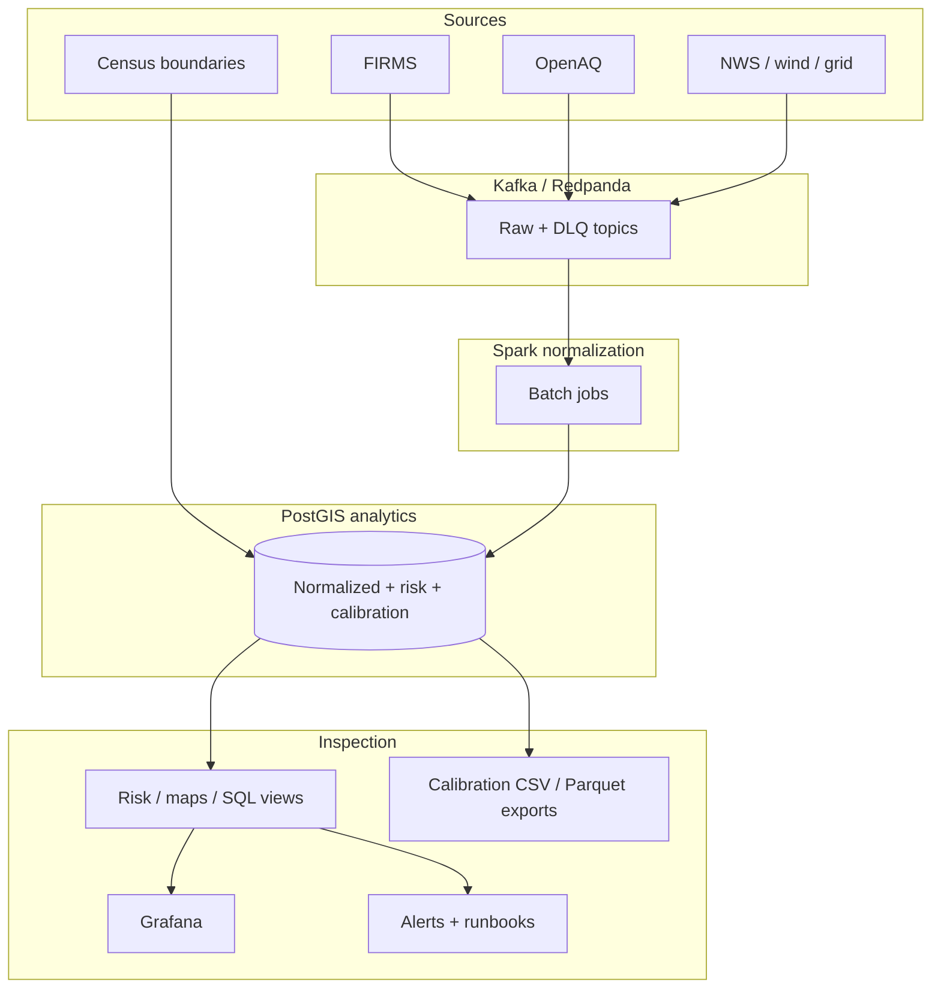

# Data flow

## Ingest

1. Producers publish to **raw Kafka topics** (`firms.hotspots.raw`, `openaq.measurements.raw`, `weather.wind.raw`, optional `weather.grid.raw`).
2. Malformed payloads may be copied to **source DLQs** and/or summarized in **`analytics.parse_errors`**.

## Normalize

3. Spark jobs consume raw topics and upsert **`normalized.*`** rows (fires, AQ, wind, optional grid cells).
4. Spatial enrichment sets **`county_geoid`** / **`tract_geoid`** when points fall inside **`geo.*`**.

## Derive

5. **Plume** jobs write **`analytics.smoke_plume_exposures`** (`wind_v1`, `wind_grid_v2` corridor heuristics).
6. Optional **dispersion** jobs write **`analytics.smoke_dispersion_exposures`** (`gaussian_v0` proxy — not regulatory dispersion).
7. **Risk** jobs write **`analytics.smoke_risk_scores`** (models **v1–v5** per configuration).
8. Optional **dispersion vs AQ** comparisons land in **`analytics.dispersion_aq_comparisons`** with **evidence labels**.

## Observe / evaluate

9. **`analytics.risk_observations`** and **`make evaluate-risk`** populate **`analytics.risk_model_evaluations`** — **engineering metrics only**.

## Present / alert

10. Grafana reads **`analytics.v_*`** views.
11. **`analytics.fn_alert_candidates`** surfaces candidates; **`analytics.alert_events`** stores materialized incidents when enabled.

## Calibration exports

**`make export-calibration`** writes timestamped CSV bundles (optional Parquet) under **`artifacts/calibration/<UTC-stamp>/`** with redacted metadata — offline review snapshots, not regulatory submissions.

