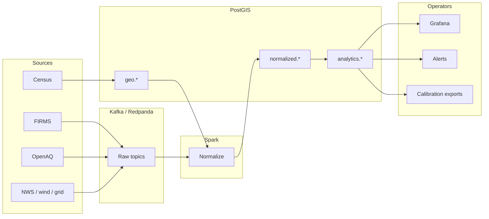

# Architecture overview

This project is a **bounded vertical slice** that joins wildfire hotspot detections, air-quality observations, and optional meteorology into **PostGIS** census units, then publishes **engineering smoke-risk indices** and diagnostic SQL views.

## Major components

| Layer | Role |
|-------|------|
| **Kafka** | Buffers raw payloads (FIRMS CSV rows, OpenAQ measurements, wind, optional grid weather). |
| **Apache Spark** | Batch jobs normalize Kafka topics into **`normalized.*`** with spatial joins to **`geo.*`**. |
| **Postgres + PostGIS** | Census geometries, normalized facts, risk scores, calibration tables, alert primitives. |
| **Python jobs** | Plume, optional dispersion proxy, risk scoring (often run in the Spark app container). |
| **Grafana** | Optional — maps and tables over stable **`analytics.v_*`** views. |

## Design stance

- **Inspectability** over opaque services: prefer SQL views and explicit jobs.
- **Honest uncertainty**: calibration labels and dashboards distinguish **insufficient data** from **weak evidence** — not validated forecast skill.

Read also: **[Data flow](dataflow.md)**, **[Data model](data-model.md)**, **[Operational model](operational-model.md)**.
