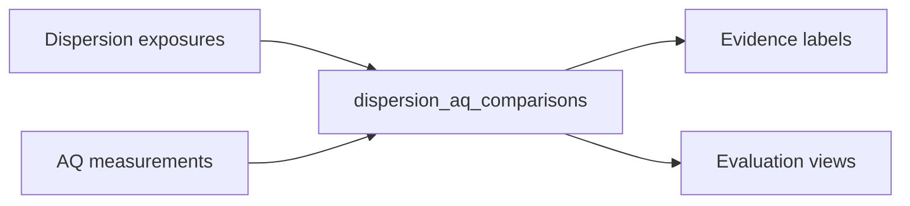

# Calibration and evaluation

The repo includes **evaluation scaffolding** — correlation-style metrics and qualitative labels — **not** peer-reviewed validation.

## Observation fixtures

Load JSONL fixtures into **`analytics.risk_observations`**:

```bash
make load-risk-observation-fixtures
```

## Compare scores vs observations

```bash
make evaluate-risk
```

Honors **`RISK_EVAL_MODEL_VERSION`**, **`RISK_EVAL_MIN_MATCH_COUNT`**, and related vars (see **[Environment](../reference/environment.md)**). Exits **0** when there is nothing to compare.

## Dispersion vs AQ evidence

**`analytics.dispersion_aq_comparisons`** carries **`evidence_label`** values (e.g. insufficient AQ data, heuristic mismatch flags). Summaries live in views such as **`analytics.v_dispersion_aq_evidence_summary`**.



## Heavy demos

**`make calibration-demo`** runs a long Spark-heavy chain — use when you need end-to-end calibration plumbing, not for quick smoke tests.

## Strict asserts

**`STRICT_CALIBRATION_ASSERTS=1`** tightens checks in integration-style scripts — optional.
