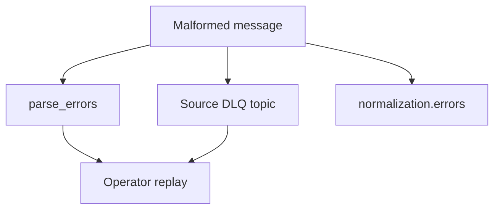

# Dead-letter queues and replay

Bad Kafka payloads are **quarantined** into **`analytics.parse_errors`** so valid rows in the same batch still normalize. Source-specific DLQs and **`normalization.errors`** capture accountability.

## Replay tooling

- **`make replay-bad-fixtures`** — publishes intentionally bad payloads for testing.
- **`scripts/replay_dlq.sh`** — **`DRY_RUN=1`** by default; explicit flags for resolving rows.

## Bookkeeping

**`analytics.dlq_replay_runs`** / **`analytics.dlq_replay_items`** record replay attempts when enabled.

## Compaction

**`make parse-errors-compact`** defaults to report-only (**`DRY_RUN=1`**) — avoid deleting accountability rows without an explicit archival policy.
